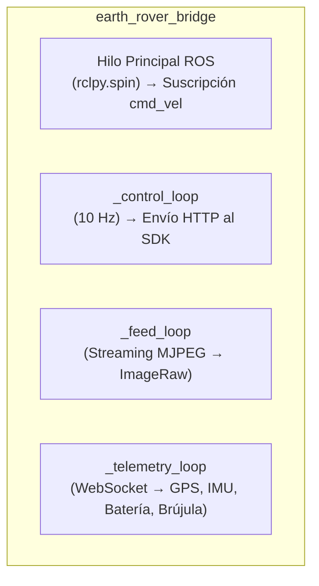
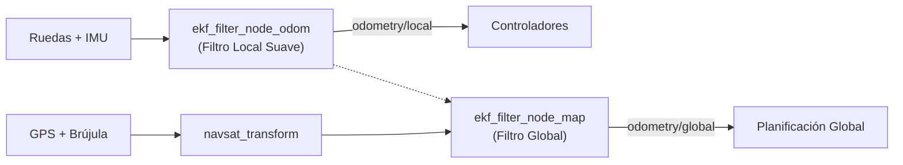
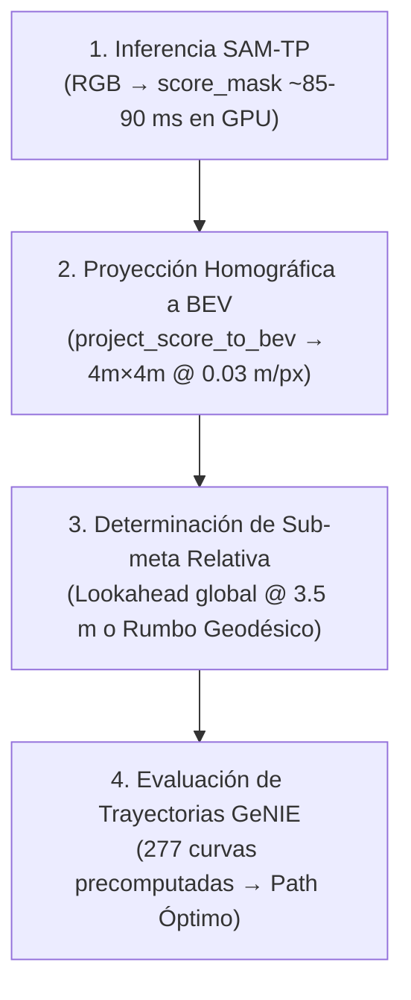

# Arquitectura del Sistema — Nodo por Nodo

Este documento describe en profundidad la arquitectura del software de navegación autónoma del rover: responsabilidades funcionales, mecanismos de concurrencia, transformaciones geométricas y fundamentos de diseño de cada nodo. Complementa al [README.md](file:///root/ros2_ws/README.md) enfocándose en el funcionamiento interno del stack.

El flujo de información sigue una estructura jerárquica: desde la ingesta de sensores y telemetría de bajo nivel, pasando por la estimación de estado, la percepción reactiva BEV, la acumulación semántica-espacial y la planificación D* Lite, hasta la generación y ejecución de comandos motrices.

---

## Estructura de Paquetes del Workspace

El sistema se distribuye en los siguientes paquetes de ROS 2:

| Paquete | Rol Principal | Componentes / Nodos Clave |
| :--- | :--- | :--- |
| **`earth_rovers_sdk`** | Puente entre el SDK HTTP/WebSocket y ROS 2 | `earth_rover_bridge` |
| **`mini_plus_localization`** | Localización y fusión sensorial dual (EKF local y global) | `ekf_filter_node_odom`, `ekf_filter_node_map`, `navsat_transform` |
| **`er_perception`** | Percepción reactiva ligera y utilidades de transitabilidad | `traversability_node`, generadores de overlays visuales |
| **`er_planning`** | Planificación reactiva local, mapa persistente y ruta global | `bev_planner_node`, `persistent_map_node`, `global_planner_node` |
| **`er_navigation`** | Control cinemático de seguimiento de trayectoria | `gps_waypoint_controller` |
| **`er_mission`** | Gestión de máquina de estados de misión y checkpoints | `mission_manager_node` |
| **`er_bringup`** | Orquestación de lanzamiento y gestión de fases | `mission1.launch.py`, `mission_manager.launch.py` |

---

## Índice de Nodos

1. [x] [**`earth_rover_bridge`**](#1-earth_rover_bridge) *(paquete `earth_rovers_sdk`)*
2. [x] [**`mini_plus_localization`**](#2-mini_plus_localization) *(paquete `mini_plus_localization` — EKF dual, `navsat_transform`)*
3. [x] [**`bev_planner_node`**](#3-bev_planner_node) *(paquete `er_planning` / integración con `er_perception`)*
4. [x] [**`persistent_map_node`**](#4-persistent_map_node) *(paquete `er_planning`)*
5. [x] [**`global_planner_node`**](#5-global_planner_node) *(paquete `er_planning`)*
6. [ ] [**`gps_waypoint_controller`**](#6-gps_waypoint_controller) *(paquete `er_navigation`)* — *(pendiente)*
7. [ ] [**`mission_manager_node`**](#7-mission_manager_node) *(paquete `er_mission`)* — *(pendiente)*

---

## 1. `earth_rover_bridge`

> **Paquete:** `earth_rovers_sdk`  
> **Rol:** Interfaz de comunicación entre el servidor SDK de hardware y ROS 2

### Rol y arquitectura general

Este nodo actúa como capa de abstracción de hardware y traducción de protocolos. No ejecuta lógica de navegación ni de decisión:
1. Ingesta el flujo de datos del servidor SDK (servicio Hypercorn en puerto `:8000`) y lo transforma a tipos de mensajes estándar de ROS 2 (`sensor_msgs`, `nav_msgs`).
2. Recibe los comandos de velocidad (`cmd_vel`) generados por la capa de control (`gps_waypoint_controller`) y los transmite al SDK vía peticiones HTTP.

El nodo opera mediante **cuatro hilos concurrentes**, desacoplados por requerimientos de latencia y volumen de datos:

- **Hilo principal de ROS (`rclpy.spin`):** Atiende exclusivamente las suscripciones de entrada (`cmd_vel`).
- **`_control_loop`:** Despacha comandos de velocidad al SDK a una frecuencia periódica estricta de 10 Hz.
- **`_feed_loop`:** Captura y publica el stream de video de la cámara frontal.
- **`_telemetry_loop`:** Procesa el flujo WebSocket continuo con lecturas de GPS, IMU, nivel de batería y brújula.

> [!NOTE]
> **Aislamiento de hilos por criticidad temporal:**  
> La separación multihilo evita que operaciones de alta carga de E/S (como la decodificación de video MJPEG o el procesamiento de tramas WebSocket) bloqueen la emisión determinística del bucle de control de 100 ms.

---

### Políticas de Calidad de Servicio (QoS)

Se configuran dos perfiles de QoS diferenciados según la naturaleza del flujo de datos:

| Perfil QoS | Política de Fiabilidad | Tópicos Asociados | Justificación de Diseño |
| :--- | :--- | :--- | :--- |
| `image_qos` | `BEST_EFFORT` | Cámara, Batería, Heading | Flujos continuos de alta frecuencia donde prima la baja latencia sobre la recuperación de paquetes perdidos. |
| `filter_qos` | `RELIABLE` | IMU, Odometría, GPS | Flujos de estimación de estado consumidos por filtros EKF. |

> [!WARNING]
> **Compatibilidad de QoS con `robot_localization`:**  
> Los suscriptores de la librería `robot_localization` operan por defecto con política `RELIABLE`. Si un publicador emite bajo `BEST_EFFORT`, la capa intermedia DDS descarta las muestras sin emitir alertas ni errores en tiempo de ejecución, provocando que los filtros de estimación queden inactivos silenciosamente.

---

### Modelado de Covarianzas Sensoriales

El nodo parametriza matrices de covarianza para calibrar la ponderación de cada sensor en el filtro de Kalman:

- **Odometría de ruedas:** Aplica una penalización estricta a la velocidad lateral ($v_y$, varianza $2.0$) debido a las restricciones no holonómicas del chasis con ruedas (el deslizamiento lateral representa perturbación no informativa).
- **IMU:** Varianza inflada controlada ($0.05$ - $0.1$) para absorber vibraciones mecánicas inducidas por los cuatro motores DC y fluctuaciones de temporización del canal de telemetría.
- **GPS:** Covarianza de altitud fuertemente penalizada ($100.0$ frente a $1.0$ en plano horizontal) dado el error vertical intrínseco del posicionamiento geodésico y el carácter bidimensional de la navegación del rover.

Todas las matrices están expuestas mediante `declare_parameter`, permitiendo calibraciones dinámicas vía archivos `.yaml` sin recompilación de código.

---

### Bucle de Control y Mecanismo Dead Man's Switch (`_control_loop`)

`_on_cmd_vel` almacena el comando de velocidad más reciente con su correspondiente marca de tiempo bajo protección de bloqueo de exclusión mutua (`threading.Lock`).

`_control_tick` ejecuta a 10 Hz e implementa la protección de seguridad principal:

> [!IMPORTANT]
> **Mecanismo de Parada por Pérdida de Comunicación (Dead Man's Switch):**  
> Si transcurren más de $0.5\text{ s}$ (`CMD_VEL_TIMEOUT_S`) sin recibir consignas de velocidad válidas, el nodo transmite automáticamente `{linear: 0, angular: 0}`. Esto garantiza que ante caídas o congelamientos de los nodos aguas arriba, el vehículo se detenga de forma autónoma en un intervalo máximo de 500 ms.

Adicionalmente, se publica telemetría de diagnóstico en `bridge_debug` registrando el retardo total del ciclo (tiempo de recepción ROS, despacho HTTP y confirmación del servidor), permitiendo caracterizar la latencia del canal de comunicaciones para el diseño de controladores predictivos (ej. Predictor de Smith / MPC).

---

### Conversión de Convenciones de Orientación (`_compass_heading_to_enu_yaw`)

La brújula electrónica reporta rumbos bajo la convención de navegación clásica ($0^\circ = \text{Norte}$, sentido horario). El estándar espacial de ROS (REP-103) estipula el marco ENU (*East-North-Up*: $0\text{ rad} = \text{Este}$, sentido antihorario).

Para garantizar la consistencia en el EKF, la transformación matemática aplicada es:

$$\text{yaw}_{\text{ENU}} = \left(\frac{\pi}{2} - \text{heading}_{\text{rad}}\right) + \delta_{\text{mag}}$$

donde $\delta_{\text{mag}}$ representa la declinación magnética local configurable por parámetro.

---

### Adquisición de Video (`_feed_loop`)

El stream MJPEG es adquirido mediante OpenCV (`cv2.VideoCapture`).

- **Reducción de Latencia:** Se configura `capture.set(cv2.CAP_PROP_BUFFERSIZE, 1)`. Esta restricción impide la acumulación de tramas antiguas en buffer, asegurando que los nodos de percepción procesen siempre el fotograma más reciente disponible.
- **Resiliencia de Conexión:** Implementa reconexión periódica cada 3 segundos ante cortes en el transporte de red.

---

### Telemetría y Preprocesamiento Sensorial (`_telemetry_loop`)

El procesamiento de tramas WebSocket entrantes comprende cuatro etapas:

1. **Validación y Escalado Dinámico de GPS:**  
   Prioriza el indicador de estado de fijación (`fix_quality`). Ante ausencia del campo, valida un umbral mínimo de 4 satélites visibles. Si la solución es inválida o el indicador de dispersión geométrica (HDOP) supera 20, descarta la lectura y activa modo de navegación a estima (*Dead-Reckoning*).  
   La matriz de covarianza asociada se modula dinámicamente en función de $\text{HDOP}^2$, atenuando la influencia del sensor cuando la constelación geométrica es desfavorable.

2. **Publicación de Orientación:**  
   Publica el rumbo directo para consumo de control y el yaw convertido a formato ENU para la fusión en el EKF.

3. **Monitoreo de Batería:**  
   Publicación directa del estado de carga energética.

4. **Reconstrucción Temporal de IMU y Odometría:**  
   El hardware transmite ráfagas de 100 muestras de aceleración y velocidad angular cada 2 segundos. El nodo interpola uniformemente marcas de tiempo retroactivas ($dt = 2.0 / N \approx 50\text{ Hz}$) para reconstruir una serie temporal continua admisible por el EKF.  
   La odometría de tracción se calcula mediante integración cinemática bidimensional ($v \cdot \Delta t \cdot [\cos(\theta), \sin(\theta)]$), generando la pose relativa base en `odometry/local`.

---

### Secuencia de Apagado Controlado (`destroy_node`)

Durante la destrucción del nodo (señales `SIGINT` / `SIGTERM`), el método `destroy_node` despacha hasta 3 consignas consecutivas de parada `{linear: 0, angular: 0}` antes de clausurar la sesión HTTP, asegurando la inmovilización inmediata del vehículo.

---

## 2. `mini_plus_localization`

> **Paquete:** `mini_plus_localization`  
> **Rol:** Estimación de estado y fusión multisensorial mediante arquitectura Dual-EKF

### Arquitectura Dual-EKF

Para conciliar la necesidad de una estimación continua y suave con el anclaje georreferenciado global, se implementa una topología de dos filtros de Kalman extendidos en cascada (`robot_localization`):

- **Filtro Local (`ekf_filter_node_odom`):** Fusiona exclusivamente odometría de ruedas e IMU. Publica `odometry/local` y la transformada `odom` $\to$ `base_link`. Su salida es continua y monótona, libre de discontinuidades por saltos de señal de satélite, ideal para los lazos de control cinemático.
- **Filtro Global (`ekf_filter_node_map`):** Fusiona la odometría local junto a las lecturas geodésicas procesadas por `navsat_transform`. Publica `odometry/global` y la transformada `map` $\to$ `odom`.

---

### Estructura del Árbol de Transformadas (TF)

La cadena cinemática global se define según las especificaciones de ROS:

$$\text{map} \xrightarrow[\text{ekf\_filter\_node\_map}]{} \text{odom} \xrightarrow[\text{ekf\_filter\_node\_odom}]{} \text{base\_link}$$

Ambos nodos operan con `publish_tf: true` complementándose mutuamente sin generar redundancias en el grafo de transformadas.

---

### Parámetros Críticos de Configuración

- **`odom0_config` (Filtro Local):** Se restringe únicamente a velocidades lineales ($V_x, V_y$), delegando la velocidad angular y orientación estrictamente a la IMU para mitigar el error por deslizamiento de ruedas.
- **`imu0_relative`:** Configurado en `true` para el filtro local (origen relativo en $\text{yaw}=0$) y en `false` para el filtro global (orientación absoluta respecto al polo magnético/geográfico).
- **Compensación de Retardo de Red:** Parámetros `sensor_timeout: 2.0`, `delay: 0.1` y `transform_time_offset: 0.05`. Este último publica las transformadas con un adelanto de 50 ms para prevenir errores de extrapolación temporal en nodos clientes ante fluctuaciones de red.

---

### Proyección Geodésica (`navsat_transform`)

El nodo `navsat_transform` convierte coordenadas geográficas (latitud, longitud, altitud) en posiciones cartesianas métricas dentro del marco `map`.

La inicialización del origen geodésico (*datum*) se realiza cargando `datum_resolved.yaml` (calculado dinámicamente en la inicialización a partir del primer checkpoint), evitando la selección arbitraria del primer fix GPS ruidoso.

---

## 3. `bev_planner_node`

> **Paquete:** `er_planning` *(Integración de modelos de `er_perception`)*  
> **Rol:** Percepción de transitabilidad en perspectiva cenital (BEV) y planificación reactiva local

### Rol y Mecánica de Ejecución

Constituye el subsistema reactivo de evasión de obstáculos en el entorno inmediato ($4\text{ m}$). Opera de forma autónoma calculando trayectorias seguras hacia sub-metas intermedias o directas a destino.

El procesamiento se desacopla en un hilo independiente (`_planning_loop`):
1. Consume el fotograma más reciente almacenado en `self._latest_rgb`.
2. Impone un período mínimo de cómputo (`planning_min_period_s = 0.1` $\to$ máx. 10 Hz).
3. Si la tasa de generación de imágenes excede la capacidad de inferencia, se descartan fotogramas intermedios para garantizar nula acumulación de latencia en la toma de decisiones.

---

### Pipeline de Planificación por Cuadro (`_run_planning`)

1. **Inferencia de Transitabilidad (SAM-TP):** Segmenta la superficie transitable generando una matriz de puntuación continua (`score_mask`). Tiempo de ejecución típico: ~85–90 ms en acelerador GPU.
2. **Proyección en Perspectiva Cenital (`project_score_to_bev`):** Mediante parámetros intrínsecos (`camera_k`) y extrínsecos (`camera_t`) con hipótesis de plano de suelo (`ground_z = 0.0`), proyecta la máscara a una grilla métrica cenital de $4\text{m} \times 4\text{m}$ ($133 \times 133$ celdas a $0.03\text{ m/px}$). Publica la grilla en `earth_rover/local_bev_grid`.
3. **Selección de Meta Relativa:**
   - *Modo Jerárquico:* Si existe una ruta global válida y vigente (`_global_path_is_fresh()`, antigüedad $< 3.0\text{ s}$), extrae una sub-meta a una distancia de prospección (`global_lookahead_distance_m = 3.5\text{ m}`).
   - *Modo Fallback:* Si la ruta global expira o es inválida, computa el rumbo directo por trigonometría esférica (fórmula de Haversine).
4. **Optimización de Trayectoria GeNIE (`_plan_on_bev`):** Evalúa un conjunto de 277 primitivas de movimiento precomputadas contra la grilla de costos locales, aplicando filtrado de colisión (`threshold_cost = 0.50`), agrupamiento direccional (`max_clusters = 4`) y fusión de los mejores candidatos (`best_k = 12`).

---

### Transformaciones Geométricas Locales vs Globales

- **`genie_xy_to_ros_base_link()`:** Convierte la salida cinemática local de GeNIE al estándar ROS ($x_{\text{adelante}} = y_{\text{genie}}, y_{\text{izquierda}} = -x_{\text{genie}}$) mediante rotación rígida constante a tiempo idéntico.
- **`_compute_global_subgoal_base_link()`:** Transforma puntos expresados en el marco inercial `map` al marco móvil `base_link` utilizando la pose completa y orientación $\text{yaw}$ provistas por TF en el instante actual.

---

## 4. `persistent_map_node`

> **Paquete:** `er_planning`  
> **Rol:** Memoria espacial acumulativa y fusión de evidencia sensorial con información semántica

### Estructura de Doble Canal

El mapa global integra dos capas de información complementarias:
- **Capa Dinámica (`self._confidence`):** Registra observaciones sensoriales locales de la cámara. Aplica decaimiento exponencial periódico (`decay_factor = 0.7738` cada 5 s, vida media efectiva $\approx 12\text{ s}$) para olvidar obstáculos temporales.
- **Capa Semántica Estática (`self._semantic`):** Representa información previa de infraestructura (veredas, calzadas) extraída de OpenStreetMap (`seed_map_path`). No decae con el tiempo.

---

### Ingesta y Agregación de Evidencia (`_on_local_grid`)

1. **Transformación Rígida de Grilla:** Proyecta las celdas locales al marco `map` aplicando la traslación y ángulo $\theta$ derivados del árbol TF:
   $$x_{\text{map}} = t_x + x_{\text{local}}\cos(\theta) - y_{\text{local}}\sin(\theta)$$
   $$y_{\text{map}} = t_y + x_{\text{local}}\sin(\theta) + y_{\text{local}}\cos(\theta)$$
2. **Discretización:** Convierte coordenadas métricas continuas a índices discretos en la grilla global de $400\text{m} \times 400\text{m}$ con resolución de $0.20\text{ m/px}$.
3. **Votación Agrupada por Celda:** Dado que $\approx 44$ celdas de la grilla local ($0.03\text{ m/px}$) coinciden espacialmente sobre una única celda de la grilla persistente ($0.20\text{ m/px}$), el nodo agrupa las observaciones locales (`np.unique`) y emite un único voto por celda global por cuadro (voto positivo si la fracción de celdas locales con obstáculo supera `hit_vote_threshold = 0.15`).

---

### Regla de Fusión Semántica y Evidencia Dinámica

La combinación de canales implementa una regla de precedencia condicional:

$$\text{grid\_effective} = \begin{cases} 
\max(C, S) & \text{si } C \ge \text{semantic\_override\_threshold} \\
S & \text{si } |S| \ge \text{unknown\_evidence\_band} \\
C & \text{en otro caso}
\end{cases}$$

Con `semantic_override_threshold = 30.0`, se asegura que la evidencia sensorial de la cámara deba registrar un mínimo de 2 detecciones consecutivas para imponer un obstáculo sobre un área categorizada a priori como transitable (vereda).

---

## 5. `global_planner_node`

> **Paquete:** `er_planning`  
> **Rol:** Planificación global de rutas de largo alcance mediante D* Lite

### Fundamento Algorítmico (D* Lite)

A diferencia de algoritmos estáticos como A* (que recalculan el árbol de búsqueda completo desde el nodo origen ante cualquier modificación del entorno), **D\* Lite** mantiene la estructura de costos a la meta y propaga incrementalmente los cambios únicamente sobre las celdas afectadas y sus vecinos inmediatos.

---

### Conversión de Grilla de Ocupación a Costos de Tránsito (`_on_map`)

Los valores de `nav_msgs/OccupancyGrid` se asignan a pesos de tránsito para el grafo de búsqueda:

| Valor en Grilla | Clasificación | Costo Asignado ($c$) | Comportamiento en Planificación |
| :---: | :---: | :---: | :--- |
| `-1` | Desconocido | $2.5$ | Costo moderado que permite exploración cautelosa. |
| $[0, 40]$ | Libre confirmado | $1.0$ | Costo mínimo unitario (preferencia máxima). |
| $(40, 78)$ | Zona de transición | Interp. lineal $[1.0, 15.0]$ | Costo progresivamente penalizado. |
| $\ge 78$ | Ocupado confirmado | $\infty$ | Arista intransitable (bloqueo total). |

#### Inflación de Huella (*Footprint Inflation*)
Las celdas con costo infinito son dilatadas morfológicamente según el radio físico del chasis:
$$\text{inflation\_cells} = \left\lceil \frac{\text{footprint\_inflation\_radius\_m}}{\text{map\_resolution\_m\_per\_px}} \right\rceil = \left\lceil \frac{0.15}{0.20} \right\rceil = 1\text{ celda}$$
La máscara de dilatación en base a la norma $(x^2 + y^2) \le 1$ genera una conectividad en cruz de 4 vecinos, aproximando un perímetro circular sin sobreestimación diagonal.

---

### Consistencia de Vértices ($g$ vs $rhs$)

D* Lite modela la consistencia de cada nodo $u$ mediante dos variables:
- $g(u)$: Costo computado actual para alcanzar la meta desde $u$.
- $rhs(u)$: Estimación en un paso basada en los costos de los vecinos inmediatos:
  $$rhs(u) = \min_{s' \in \text{Succ}(u)} \left( c(u, s') + g(s') \right)$$

$$\begin{cases}
g(u) = rhs(u) & \implies \text{Vértice Consistente} \\
g(u) \neq rhs(u) & \implies \text{Vértice Inconsistente (se inserta en la cola de prioridad)}
\end{cases}$$

El bucle `_compute_shortest_path` procesa vértices inconsistentes en orden de prioridad hasta restablecer la consistencia en el nodo donde se ubica el rover (`s_start`).

---

### Compensación de Desplazamiento ($k_m$) y Borrado Perezoso

- **Término de Compensación $k_m$:** Al desplazarse el vehículo, la distancia heurística cambia para todos los nodos. D* Lite evita actualizar las claves de toda la cola acumulando el desplazamiento en $k_m \leftarrow k_m + h(s_{\text{last}}, s_{\text{current}})$, modificando únicamente las claves de los elementos reevaluados.
- **Borrado Perezoso (*Lazy Removal*):** Para evitar reordenamientos costosos en el montículo binario (`heapq`), las claves invalidadas se eliminan de un diccionario auxiliar `_pq_dict`. Al extraer elementos de la cola, se descartan aquellos cuya versión no coincida con el registro activo.

---

### Temporización y Modulación de Replanificación

- **Sondeo y Ventana Mínima:** Posee un temporizador base de sondeo a 2 Hz (`heartbeat_period_s = 0.5`), pero exige un intervalo mínimo entre replanificaciones completas (`replan_min_period_s = 2.0\text{ s}`).
- **Disparo Asíncrono Reactivo:** Si se recibe una actualización crítica del mapa persistente tras expirar el período de 2 s, `_on_map` lanza la replanificación inmediatamente sin esperar al siguiente ciclo del temporizador.
- **Validación de Localización:** Si la celda correspondiente a la pose del rover posee costo infinito, el planificador rechaza la búsqueda (`is_valid = False`), protegiendo el sistema contra errores de divergencia en la estimación de estado.

---

## 6. `gps_waypoint_controller`

> **Paquete:** `er_navigation`  
> **Rol:** Seguimiento cinemático de waypoints y control de velocidad

*(Sección en desarrollo — pendiente de documentación detallada)*

---

## 7. `mission_manager_node`

> **Paquete:** `er_mission`  
> **Rol:** Gestión de objetivos de alto nivel y máquina de estados de misión

*(Sección en desarrollo — pendiente de documentación detallada)*
