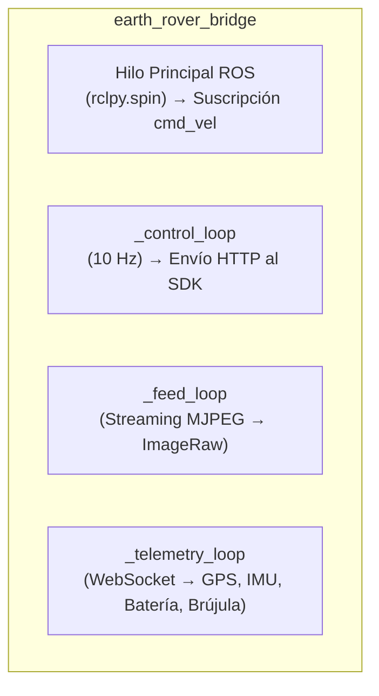
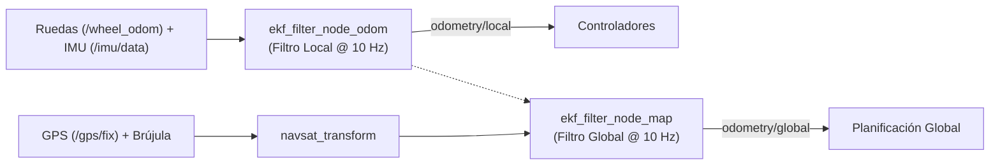
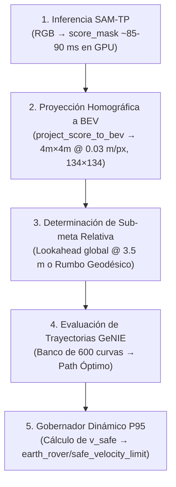
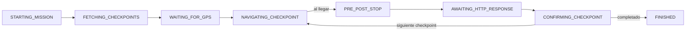

# Arquitectura del Sistema — Nodo por Nodo

Este documento describe en profundidad la arquitectura del software de navegación autónoma del rover: responsabilidades funcionales, mecanismos de concurrencia, transformaciones geométricas y fundamentos de diseño de cada nodo. Complementa al [README.md](file:///root/ros2_ws/README.md) enfocándose en el funcionamiento interno del stack.

El flujo de información sigue una estructura jerárquica: desde la ingesta de sensores y telemetría de bajo nivel, pasando por la estimación de estado, la percepción reactiva BEV, la acumulación semántica-espacial y la planificación D* Lite, hasta la generación y ejecución de comandos motrices.

---

## Estructura de Paquetes del Workspace

El sistema se distribuye en los siguientes paquetes de ROS 2:

| Paquete | Rol Principal | Componentes / Nodos Clave |
| :--- | :--- | :--- |
| **`earth_rovers_sdk`** | Puente entre el SDK HTTP/WebSocket y ROS 2 | `earth_rover_bridge` |
| **`mini_plus_localization`** | Localización y fusión sensorial dual (EKF local y global) | `ekf_filter_node_odom`, `ekf_filter_node_map`, `navsat_transform` |
| **`er_perception`** | Percepción reactiva ligera y utilidades de transitabilidad | `traversability_node`, generadores de overlays visuales |
| **`er_planning`** | Planificación reactiva local, mapa persistente y ruta global | `bev_planner_node`, `persistent_map_node`, `global_planner_node` |
| **`er_navigation`** | Control cinemático de seguimiento de trayectoria | `gps_waypoint_controller` |
| **`er_mission`** | Gestión de máquina de estados de misión y checkpoints | `mission_manager_node` |
| **`er_bringup`** | Orquestación de lanzamiento y gestión de fases | `mission1.launch.py`, `mission_manager.launch.py` |

---

## Índice de Nodos y Subsistemas

1. [x] [**`earth_rover_bridge`**](#1-earth_rover_bridge) *(paquete `earth_rovers_sdk`)*
2. [x] [**`mini_plus_localization`**](#2-mini_plus_localization) *(paquete `mini_plus_localization` — EKF dual, `navsat_transform`)*
3. [x] [**`bev_planner_node`**](#3-bev_planner_node) *(paquete `er_planning` / integración con `er_perception`)*
4. [x] [**`persistent_map_node`**](#4-persistent_map_node) *(paquete `er_planning`)*
5. [x] [**`global_planner_node`**](#5-global_planner_node) *(paquete `er_planning`)*
6. [x] [**`gps_waypoint_controller`**](#6-gps_waypoint_controller) *(paquete `er_navigation`)*
7. [x] [**`mission_manager_node`**](#7-mission_manager_node) *(paquete `er_mission`)*
8. [x] [**`Filtro Complementario Roll/Pitch`**](#8-filtro-complementario-de-inclinación-roll--pitch) *(paquete `earth_rovers_sdk`)*
9. [x] [**`Gobernador Dinámico de Velocidad`**](#9-gobernador-dinámico-de-velocidad) *(paquete `er_planning`)*
10. [x] [**`Limitaciones Conocidas y Trabajo Pendiente`**](#10-limitaciones-conocidas-y-trabajo-pendiente) *(análisis integral)*

---

## 1. `earth_rover_bridge`

> **Paquete:** `earth_rovers_sdk`  
> **Rol:** Interfaz de comunicación entre el servidor SDK de hardware y ROS 2

### Rol y arquitectura general

Este nodo actúa como capa de abstracción de hardware y traducción de protocolos. No ejecuta lógica de navegación ni de decisión:
1. Ingesta el flujo de datos del servidor SDK (servicio Hypercorn en puerto `:8000`) y lo transforma a tipos de mensajes estándar de ROS 2 (`sensor_msgs`, `nav_msgs`).
2. Recibe los comandos de velocidad (`cmd_vel`) generados por la capa de control (`gps_waypoint_controller`) y los transmite al SDK vía peticiones HTTP.

El nodo opera mediante **cuatro hilos concurrentes**, desacoplados por requerimientos de latencia y volumen de datos:

- **Hilo principal de ROS (`rclpy.spin`):** Atiende exclusivamente las suscripciones de entrada (`cmd_vel`).
- **`_control_loop`:** Despacha comandos de velocidad al SDK a una frecuencia periódica estricta de 10 Hz.
- **`_feed_loop`:** Captura y publica el stream de video de la cámara frontal.
- **`_telemetry_loop`:** Procesa el flujo WebSocket continuo con lecturas de GPS, IMU, nivel de batería y brújula.

> [!NOTE]
> **Aislamiento de hilos por criticidad temporal:**  
> La separación multihilo evita que operaciones de alta carga de E/S (como la decodificación de video MJPEG o el procesamiento de tramas WebSocket) bloqueen la emisión determinística del bucle de control de 100 ms.

---

### Políticas de Calidad de Servicio (QoS)

Se configuran dos perfiles de QoS diferenciados según la naturaleza del flujo de datos:

| Perfil QoS | Política de Fiabilidad | Tópicos Asociados | Justificación de Diseño |
| :--- | :--- | :--- | :--- |
| `image_qos` | `BEST_EFFORT` | Cámara, Batería, Heading | Flujos continuos de alta frecuencia donde prima la baja latencia sobre la recuperación de paquetes perdidos. |
| `filter_qos` | `RELIABLE` | IMU, Odometría, GPS | Flujos de estimación de estado consumidos por filtros EKF. |

> [!WARNING]
> **Compatibilidad de QoS con `robot_localization`:**  
> Los suscriptores de la librería `robot_localization` operan por defecto con política `RELIABLE`. Si un publicador emite bajo `BEST_EFFORT`, la capa intermedia DDS descarta las muestras sin emitir alertas ni errores en tiempo de ejecución, provocando que los filtros de estimación queden inactivos silenciosamente.

---

### Modelado de Covarianzas Sensoriales

El nodo parametriza matrices de covarianza para calibrar la ponderación de cada sensor en el filtro de Kalman:

- **Odometría de ruedas:** Aplica una penalización estricta a la velocidad lateral ($v_y$, varianza $2.0$) debido a las restricciones no holonómicas del chasis con ruedas (el deslizamiento lateral representa perturbación no informativa).
- **IMU:** Varianza inflada controlada ($0.05$ - $0.1$) para absorber vibraciones mecánicas inducidas por los cuatro motores DC y fluctuaciones de temporización del canal de telemetría.
- **GPS:** Covarianza de altitud fuertemente penalizada ($100.0$ frente a $1.0$ en plano horizontal) dado el error vertical intrínseco del posicionamiento geodésico y el carácter bidimensional de la navegación del rover.

Todas las matrices están expuestas mediante `declare_parameter`, permitiendo calibraciones dinámicas vía archivos `.yaml` sin recompilación de código.

---

### Bucle de Control y Mecanismo Dead Man's Switch (`_control_loop`)

`_on_cmd_vel` almacena el comando de velocidad más reciente con su correspondiente marca de tiempo bajo protección de bloqueo de exclusión mutua (`threading.Lock`).

`_control_tick` ejecuta a 10 Hz e implementa la protección de seguridad principal:

> [!IMPORTANT]
> **Mecanismo de Parada por Pérdida de Comunicación (Dead Man's Switch):**  
> Si transcurren más de $0.5\text{ s}$ (`CMD_VEL_TIMEOUT_S`) sin recibir consignas de velocidad válidas, el nodo transmite automáticamente `{linear: 0, angular: 0}`. Esto garantiza que ante caídas o congelamientos de los nodos aguas arriba, el vehículo se detenga de forma autónoma en un intervalo máximo de 500 ms.

Adicionalmente, se publica telemetría de diagnóstico en `bridge_debug` registrando el retardo total del ciclo (tiempo de recepción ROS, despacho HTTP y confirmación del servidor), permitiendo caracterizar la latencia del canal de comunicaciones para el diseño de controladores predictivos (ej. Predictor de Smith / MPC).

---

### Conversión de Convenciones de Orientación (`_compass_heading_to_enu_yaw`)

La brújula electrónica reporta rumbos bajo la convención de navegación clásica ($0^\circ = \text{Norte}$, sentido horario). El estándar espacial de ROS (REP-103) estipula el marco ENU (*East-North-Up*: $0\text{ rad} = \text{Este}$, sentido antihorario).

Para garantizar la consistencia en el EKF, la transformación matemática aplicada es:

$$\text{yaw}_{\text{ENU}} = \left(\frac{\pi}{2} - \text{heading}_{\text{rad}}\right) + \delta_{\text{mag}}$$

donde $\delta_{\text{mag}}$ representa la declinación magnética local configurable por parámetro.

---

### Adquisición de Video (`_feed_loop`)

El stream MJPEG es adquirido mediante OpenCV (`cv2.VideoCapture`).

- **Reducción de Latencia:** Se configura `capture.set(cv2.CAP_PROP_BUFFERSIZE, 1)`. Esta restricción impide la acumulación de tramas antiguas en buffer, asegurando que los nodos de percepción procesen siempre el fotograma más reciente disponible.
- **Resiliencia de Conexión:** Implementa reconexión periódica cada 3 segundos ante cortes en el transporte de red.

---

### Telemetría y Preprocesamiento Sensorial (`_telemetry_loop`)

El procesamiento de tramas WebSocket entrantes comprende cuatro etapas:

1. **Validación y Escalado Dinámico de GPS:**  
   Prioriza el indicador de estado de fijación (`fix_quality`). Ante ausencia del campo, valida un umbral mínimo de 4 satélites visibles. Si la solución es inválida o el indicador de dispersión geométrica (HDOP) supera 20, descarta la lectura y activa modo de navegación a estima (*Dead-Reckoning*).  
   La matriz de covarianza asociada se modula dinámicamente en función de $\text{HDOP}^2$, atenuando la influencia del sensor cuando la constelación geométrica es desfavorable.

2. **Publicación de Orientación y Cadencia del Compás:**  
   El compás electrónico del hardware transmite a través de WebSockets en reportes discretos de telemetría a una cadencia de ~0.5 Hz (un paquete cada ~2.0 segundos). Publica el rumbo directo para consumo de control y el yaw convertido a formato ENU para la fusión en el EKF. Esta baja frecuencia de actualización absoluta es la motivación fundamental para incorporar un puente inercial continuo con seguimiento de incertidumbre (`ekf_heading_bridge`), impidiendo que el controlador deba detenerse a esperar el compás tras cada maniobra de giro.

3. **Monitoreo de Batería:**  
   Publicación directa del estado de carga energética.

4. **Preprocesamiento Sensorial de IMU y Odometría:**  
   El hardware transmite ráfagas de aceleración y velocidad angular en paquetes WebSocket cada ~2 segundos.  
   * **Problema del diseño anterior:** Se interpolaban artificialmente marcas de tiempo retroactivas ($dt = 2.0 / N \approx 50\text{ Hz}$) emitiendo 100 mensajes IMU en el pasado. Esto provocaba dos fallas graves: (1) violación de la causalidad temporal en los buffers TF y descarte sistemático de paquetes en `robot_localization`, y (2) una sobreconfianza artificial de $100\times$ en el rumbo magnético que asfixiaba la estimación del EKF.  
   * **Comportamiento actual:** Se publica **un único mensaje `sensor_msgs/Imu` en `/imu/data` por reporte de telemetría** con el timestamp actual de ROS, la aceleración lineal promediada de la ráfaga (descontando `accel_bias`) y la velocidad angular promediada corregida por el sesgo calibrado (`_gyro_bias`).  
   * **Odometría de tracción:** Se calcula mediante integración cinemática bidimensional ($v \cdot \Delta t \cdot [\cos(\theta), \sin(\theta)]$) y se publica en el tópico `/wheel_odom` (`nav_msgs/Odometry`). La pose filtrada en `odometry/local` es responsabilidad exclusiva de `ekf_filter_node_odom`.  
   * **Carga de Calibración Inercial:** Mediante `_load_inertial_calibration_files()`, el bridge busca automáticamente `config/gyro_bias.json` y `config/accel_bias.json` al inicializar; si no existen, inicializa limpiamente en $0.0$.

---

### Secuencia de Apagado Controlado (`destroy_node`)

Durante la destrucción del nodo (señales `SIGINT` / `SIGTERM`), el método `destroy_node` despacha hasta 3 consignas consecutivas de parada `{linear: 0, angular: 0}` antes de clausurar la sesión HTTP, asegurando la inmovilización inmediata del vehículo.

---

## 2. `mini_plus_localization`

> **Paquete:** `mini_plus_localization`  
> **Rol:** Estimación de estado y fusión multisensorial mediante arquitectura Dual-EKF

### Arquitectura Dual-EKF

Para conciliar la necesidad de una estimación continua y suave con el anclaje georreferenciado global, se implementa una topología de dos filtros de Kalman extendidos en cascada (`robot_localization`):

- **Filtro Local (`ekf_filter_node_odom`):** Fusiona la odometría de ruedas `/wheel_odom` y la aceleración/velocidad angular de `/imu/data` a una frecuencia fija de **`frequency: 10.0` Hz**. Publica `odometry/local` y la transformada `odom` $\to$ `base_link`. Su salida es continua y monótona, libre de saltos de satélite, ideal para los lazos de control cinemático.
- **Filtro Global (`ekf_filter_node_map`):** Fusiona la odometría local junto a las lecturas geodésicas procesadas por `navsat_transform` a **`frequency: 10.0` Hz**. Publica `odometry/global` y la transformada `map` $\to$ `odom`.

---

### Estructura del Árbol de Transformadas (TF)

La cadena cinemática global se define según las especificaciones de ROS:

$$\text{map} \xrightarrow[\text{ekf\_filter\_node\_map}]{} \text{odom} \xrightarrow[\text{ekf\_filter\_node\_odom}]{} \text{base\_link}$$

Ambos nodos operan con `publish_tf: true` complementándose mutuamente sin generar redundancias en el grafo de transformadas.

---

### Parámetros Críticos y Limitación Arquitectónica de Orientación

- **`odom0_config` (Filtro Local):** Se restringe únicamente a velocidades lineales ($V_x, V_y$), manteniendo $V_{\text{yaw}}$ (índice 11) en `false`. Al carecer de encoders independientes por rueda, la velocidad angular de guiñada se delega a la IMU.
- **Limitación de Fuente Única de Guiñada:** Actualmente **no existe una fuente de orientación absoluta independiente de la brújula magnética**. Dado que `/wheel_odom` se proyecta trigonométricamente usando el mismo rumbo de compás que alimenta `/imu/data`, ambas señales se desvían de forma correlacionada ante distorsiones magnéticas del entorno, impidiendo que el EKF detecte la inconsistencia.
- **`imu0_relative`:** Configurado en `true` para el filtro local (origen relativo en $\text{yaw}=0$) y en `false` para el filtro global (orientación absoluta respecto al polo magnético/geográfico).
- **Compensación de Retardo de Red:** Parámetros `sensor_timeout: 2.0`, `delay: 0.1` y `transform_time_offset: 0.05`. Este último publica las transformadas con un adelanto de 50 ms para prevenir errores de extrapolación temporal en nodos clientes ante fluctuaciones de red.

---

### Proyección Geodésica (`navsat_transform`)

El nodo `navsat_transform` convierte coordenadas geográficas (latitud, longitud, altitud) en posiciones cartesianas métricas dentro del marco `map`, y publica `gps/filtered` convirtiendo continuamente la pose global del EKF a WGS84 por *dead-reckoning* durante cortes de señal GNSS.

La inicialización del origen geodésico (*datum*) se realiza cargando `datum_resolved.yaml` (calculado dinámicamente en la inicialización a partir del primer checkpoint), evitando la selección arbitraria del primer fix GPS ruidoso.

---

### Estimación y Propagación Continua de Rumbo (`ekf_heading_bridge`)

El nodo `ekf_heading_bridge` resuelve la brecha de frecuencia entre el compás físico (~0.5 Hz) y los requerimientos del lazo de control:

1. **Conversión de Formatos:** Extrae la orientación fusionada de `odometry/global` (publicada por `ekf_filter_node_map`), calcula el yaw ENU y lo convierte a rumbo de brújula clásico ($0^\circ = \text{Norte}$, sentido horario).
2. **Propagación Inercial con Giróscopo (Brief 22 / V.3):** Dada la cadencia lenta del compás (~0.5 Hz, cada ~2 s), esperar una nueva muestra magnética inmovilizaría al rover entre ráfagas de giro. El nodo se suscribe a `/imu/data` e integra continuamente la velocidad angular $\omega_z$ (descontando el sesgo calibrado `gyro_bias_z`):
   $$\text{yaw}(t) = \text{yaw}_{\text{compass}} - \int_{t_0}^t (\omega_z - b_z) \, dt$$
   *(El signo negativo se debe a que un giro CCW en REP-103 disminuye el rumbo horario de brújula).*
3. **Verificación Experimental en Hardware (Brief 23 / W.1):** El signo de la propagación inercial fue verificado empíricamente en el rover real con el script [`scripts/diagnose_yaw_sign.py`](file:///home/marian/ros2_ws/scripts/diagnose_yaw_sign.py). Una ráfaga controlada de $3.0\text{ s}$ a `turn_throttle = 0.70` produjo un giro medido de $51.4^\circ$ con una discrepancia de apenas $0.7^\circ$ entre compás e integración inercial, fijando la velocidad angular efectiva del rover en $\omega_{\text{yaw}} \approx 17.0^\circ/\text{s}$.
4. **Seguimiento Analítico de Incertidumbre:** Al recibir una muestra del compás, la incertidumbre se inicializa en `base_compass_uncertainty_deg = 3.0`$^\circ$. Durante la propagación giroscópica, la covarianza crece con tasa de difusión $q = 0.5^\circ/\sqrt{\text{s}}$:
   $$\sigma_{\text{yaw}}(t) = \sqrt{\sigma_{\text{base}}^2 + q^2 \cdot \Delta t}$$
   Se publica en `earth_rover/heading_uncertainty`. Si $\sigma_{\text{yaw}} < 10.0^\circ$ (`heading_trust_threshold_deg`), el controlador de navegación autoriza la ejecución inmediata de la siguiente ráfaga motriz sin esperar al compás físico.

## 3. `bev_planner_node`

> **Paquete:** `er_planning` *(Integración de modelos de `er_perception`)*  
> **Rol:** Percepción de transitabilidad en perspectiva cenital (BEV) y planificación reactiva local

### Rol y Mecánica de Ejecución

Constituye el subsistema reactivo de evasión de obstáculos en el entorno inmediato ($4\text{ m}$). Opera de forma autónoma calculando trayectorias seguras hacia sub-metas intermedias o directas a destino.

El procesamiento se desacopla en un hilo independiente (`_planning_loop`):
1. Consume el fotograma más reciente almacenado en `self._latest_rgb`.
2. Impone un período mínimo de cómputo (`planning_min_period_s = 0.1` $\to$ máx. 10 Hz).
3. Si la tasa de generación de imágenes excede la capacidad de inferencia, se descartan fotogramas intermedios para garantizar nula acumulación de latencia en la toma de decisiones.

---

### Pipeline de Planificación por Cuadro (`_run_planning`)

1. **Inferencia de Transitabilidad (SAM-TP):** Segmenta la superficie transitable generando una matriz de puntuación continua (`score_mask`). Tiempo de ejecución típico: ~85–90 ms en acelerador GPU RTX 5060 (~4.5 s en CPU).
2. **Proyección en Perspectiva Cenital (`project_score_to_bev`):** Mediante parámetros intrínsecos (`camera_k`) y extrínsecos (`camera_t`) con hipótesis de plano de suelo (`ground_z = 0.0`), proyecta la máscara a una grilla métrica cenital isótropa de $4.0\text{m} \times 4.0\text{m}$ ($134 \times 134$ celdas a $0.03\text{ m/px}$, $\lceil 4.0/0.03 \rceil = 134$). Publica la grilla en `earth_rover/local_bev_grid`.
3. **Selección de Meta Relativa:**
   - *Modo Jerárquico:* Si existe una ruta global válida y vigente (`_global_path_is_fresh()`, antigüedad $< 3.0\text{ s}$), extrae una sub-meta a una distancia de prospección (`global_lookahead_distance_m = 3.5\text{ m}`).
   - *Modo Fallback:* Si la ruta global expira o es inválida, computa el rumbo directo por trigonometría esférica (fórmula de Haversine).
4. **Optimización de Trayectoria GeNIE (`_plan_on_bev`):** 
   - El banco contiene **600 trayectorias polinomiales precomputadas una única vez al inicio en `__init__`**.
   - Evalúa las 600 curvas contra la grilla de costos locales con huella dilada. El parámetro `footprint_px` se deriva analíticamente en código mediante `compute_footprint_px()` (`footprint_px: 0` en `planner_params.yaml` activa la derivación dinámica) y no es una constante estática:
     1. **Diámetro circunscrito ($D_{\text{circ}}$):** Para un chasis skid-steer de dimensiones rectangulares $L = 0.250\text{ m}$ y $W = 0.190\text{ m}$, el giro sobre su propio eje (*in-place turn*) barre una envolvente circular de diámetro $D_{\text{circ}} = \sqrt{L^2 + W^2} = \sqrt{0.250^2 + 0.190^2} = 0.3140\text{ m}$. Modelar la huella con esta área circular barrida garantiza no colisión bajo cualquier orientación angular del chasis durante rotaciones o maniobras cerradas.
     2. **Conversión a píxeles métricos BEV:** A la resolución nativa de la grilla BEV ($\text{resolution} = 0.03\text{ m/px}$), el diámetro equivale a $D_{\text{circ}} / \text{res} = 0.3140 / 0.03 = 10.4667\text{ px}$.
     3. **Reescalado a la grilla interna del planificador GeNIE:** La grilla de GeNIE opera a resolución discreta $\text{grid\_size} = 240 \times 240$, mientras que la grilla métrica BEV es de $\text{bev\_h} \times \text{bev\_w} = 134 \times 134$ celdas ($\lceil 4.0\text{ m} / 0.03\text{ m/px} \rceil = 134$). El factor de escala es $240 / 134 \approx 1.791$, llevando la huella a $10.4667 \times (240 / 134) \approx 18.7463\text{ px}$.
     4. **Margen de seguridad y redondeo final:** Aplicando el factor de seguridad configurable `footprint_safety_margin: 1.05` y la función techo ($\lceil \cdot \rceil$) estrictamente sobre el producto final (para evitar la sobreinflación geométrica por redondeos intermedios):
        $$\text{footprint\_px} = \lceil 18.7463 \times 1.05 \rceil = \lceil 19.6836 \rceil = 20\text{ px}$$
     En un escenario despejado, tras la convolución y filtrado de colisión con esta huella de $20\text{ px}$, sobreviven al filtro típicamente $\approx 277$ curvas de las 600 iniciales.
   - Aplica agrupamiento direccional K-Means (`max_clusters = 4`) y fusión de los mejores candidatos (`best_k = 12`).
   - *Hallazgo de escalamiento:* La latencia de GeNIE escala con la cantidad de caminos sobrevivientes; por lo tanto, el planner evalúa más rápido en entornos con obstáculos que en áreas completamente despejadas.
5. **Gobernador Dinámico de Velocidad P95:** Registra la latencia total del ciclo en una ventana móvil de 30 muestras, calcula el percentil 95 ($t_{\text{plan,P95}}$) y resuelve la velocidad máxima segura $v_{\text{safe}}$ garantizando parada dentro del horizonte visible configurado ($d_{\text{horizon}} = \text{forward\_range\_m} = 4.00\text{ m}$) con margen de seguridad $1.5$. Si $v_{\text{safe}} < 0.15\text{ m/s}$, aplica corte a $0.0$ (*Stop & Wait*). Publica el límite en `earth_rover/safe_velocity_limit`.

---

### Transformaciones Geométricas Locales vs Globales

- **`genie_xy_to_ros_base_link()`:** Convierte la salida cinemática local de GeNIE al estándar ROS ($x_{\text{adelante}} = y_{\text{genie}}, y_{\text{izquierda}} = -x_{\text{genie}}$) mediante rotación rígida constante a tiempo idéntico.
- **`_compute_global_subgoal_base_link()`:** Transforma puntos expresados en el marco inercial `map` al marco móvil `base_link` utilizando la pose completa y orientación $\text{yaw}$ provistas por TF en el instante actual.
- **Validación de Isotropía:** Garantiza que la resolución métrica por píxel en el eje longitudinal ($X$) y lateral ($Y$) sea estrictamente idéntica ($0.03\text{ m/px}$), preservando la geometría euclidiana y radios de curvatura de las trayectorias muestreadas.

---

## 4. `persistent_map_node`

> **Paquete:** `er_planning`  
> **Rol:** Memoria espacial acumulativa y fusión de evidencia sensorial con información semántica

### Estructura de Doble Canal

El mapa global integra dos capas de información complementarias:
- **Capa Dinámica (`self._confidence`):** Registra observaciones sensoriales locales de la cámara. Aplica decaimiento exponencial periódico (`decay_factor = 0.7738` cada 5 s, vida media efectiva $\approx 12\text{ s}$) para olvidar obstáculos temporales.
- **Capa Semántica Estática (`self._semantic`):** Representa información previa de infraestructura (veredas, calzadas) extraída de OpenStreetMap (`seed_map_path`). No decae con el tiempo.

---

### Ingesta y Agregación de Evidencia (`_on_local_grid`)

1. **Transformación Rígida de Grilla:** Proyecta las celdas locales al marco `map` aplicando la traslación y ángulo $\theta$ derivados del árbol TF:
   $$x_{\text{map}} = t_x + x_{\text{local}}\cos(\theta) - y_{\text{local}}\sin(\theta)$$
   $$y_{\text{map}} = t_y + x_{\text{local}}\sin(\theta) + y_{\text{local}}\cos(\theta)$$
2. **Discretización:** Convierte coordenadas métricas continuas a índices discretos en la grilla global de $400\text{m} \times 400\text{m}$ con resolución de $0.20\text{ m/px}$.
3. **Votación Agrupada por Celda:** Dado que $\approx 44$ celdas de la grilla local ($0.03\text{ m/px}$) coinciden espacialmente sobre una única celda de la grilla persistente ($0.20\text{ m/px}$), el nodo agrupa las observaciones locales (`np.unique`) y emite un único voto por celda global por cuadro (voto positivo si la fracción de celdas locales con obstáculo supera `hit_vote_threshold = 0.15`).

---

### Regla de Fusión Semántica y Evidencia Dinámica

La combinación de canales implementa una regla de precedencia condicional:

$$\text{grid\_effective} = \begin{cases} 
\max(C, S) & \text{si } C \ge \text{semantic\_override\_threshold} \\
S & \text{si } |S| \ge \text{unknown\_evidence\_band} \\
C & \text{en otro caso}
\end{cases}$$

Con `semantic_override_threshold = 30.0`, se asegura que la evidencia sensorial de la cámara deba registrar un mínimo de 2 detecciones consecutivas para imponer un obstáculo sobre un área categorizada a priori como transitable (vereda).

---

## 5. `global_planner_node`

> **Paquete:** `er_planning`  
> **Rol:** Planificación global de rutas de largo alcance mediante D* Lite

### Fundamento Algorítmico (D* Lite)

A diferencia de algoritmos estáticos como A* (que recalculan el árbol de búsqueda completo desde el nodo origen ante cualquier modificación del entorno), **D\* Lite** mantiene la estructura de costos a la meta y propaga incrementalmente los cambios únicamente sobre las celdas afectadas y sus vecinos inmediatos.

---

### Conversión de Grilla de Ocupación a Costos de Tránsito (`_on_map`)

Los valores de `nav_msgs/OccupancyGrid` se asignan a pesos de tránsito para el grafo de búsqueda:

| Valor en Grilla | Clasificación | Costo Asignado ($c$) | Comportamiento en Planificación |
| :---: | :---: | :---: | :--- |
| `-1` | Desconocido | $2.5$ | Costo moderado que permite exploración cautelosa. |
| $[0, 40]$ | Libre confirmado | $1.0$ | Costo mínimo unitario (preferencia máxima). |
| $(40, 78)$ | Zona de transición | Interp. lineal $[1.0, 15.0]$ | Costo progresivamente penalizado. |
| $\ge 78$ | Ocupado confirmado | $\infty$ | Arista intransitable (bloqueo total). |

#### Inflación de Huella (*Footprint Inflation*)
Las celdas con costo infinito son dilatadas morfológicamente según el radio físico del chasis:
$$\text{inflation\_cells} = \left\lceil \frac{\text{footprint\_inflation\_radius\_m}}{\text{map\_resolution\_m\_per\_px}} \right\rceil = \left\lceil \frac{0.15}{0.20} \right\rceil = 1\text{ celda}$$
La máscara de dilatación en base a la norma $(x^2 + y^2) \le 1$ genera una conectividad en cruz de 4 vecinos, aproximando un perímetro circular sin sobreestimación diagonal.

---

### Consistencia de Vértices ($g$ vs $rhs$)

D* Lite modela la consistencia de cada nodo $u$ mediante dos variables:
- $g(u)$: Costo computado actual para alcanzar la meta desde $u$.
- $rhs(u)$: Estimación en un paso basada en los costos de los vecinos inmediatos:
  $$rhs(u) = \min_{s' \in \text{Succ}(u)} \left( c(u, s') + g(s') \right)$$

$$\begin{cases}
g(u) = rhs(u) & \implies \text{Vértice Consistente} \\
g(u) \neq rhs(u) & \implies \text{Vértice Inconsistente (se inserta en la cola de prioridad)}
\end{cases}$$

El bucle `_compute_shortest_path` procesa vértices inconsistentes en orden de prioridad hasta restablecer la consistencia en el nodo donde se ubica el rover (`s_start`).

---

### Compensación de Desplazamiento ($k_m$) y Borrado Perezoso

- **Término de Compensación $k_m$:** Al desplazarse el vehículo, la distancia heurística cambia para todos los nodos. D* Lite evita actualizar las claves de toda la cola acumulando el desplazamiento en $k_m \leftarrow k_m + h(s_{\text{last}}, s_{\text{current}})$, modificando únicamente las claves de los elementos reevaluados.
- **Borrado Perezoso (*Lazy Removal*):** Para evitar reordenamientos costosos en el montículo binario (`heapq`), las claves invalidadas se eliminan de un diccionario auxiliar `_pq_dict`. Al extraer elementos de la cola, se descartan aquellos cuya versión no coincida con el registro activo.

---

### Temporización y Modulación de Replanificación

- **Sondeo y Ventana Mínima:** Posee un temporizador base de sondeo a 2 Hz (`heartbeat_period_s = 0.5`), pero exige un intervalo mínimo entre replanificaciones completas (`replan_min_period_s = 2.0\text{ s}`).
- **Disparo Asíncrono Reactivo:** Si se recibe una actualización crítica del mapa persistente tras expirar el período de 2 s, `_on_map` lanza la replanificación inmediatamente sin esperar al siguiente ciclo del temporizador.
- **Validación de Localización:** Si la celda correspondiente a la pose del rover posee costo infinito, el planificador rechaza la búsqueda (`is_valid = False`), protegiendo el sistema contra errores de divergencia en la estimación de estado.

---

## 6. `gps_waypoint_controller`

> **Paquete:** `er_navigation`  
> **Rol:** Seguimiento cinemático de waypoints y control de velocidad (el que efectivamente mueve las ruedas)

### Rol

Es la capa más baja de la jerarquía de decisión: no decide "hacia dónde ir" en un sentido estratégico (eso lo hacen `bev_planner_node`/`global_planner_node`), decide cómo traducir "hacia allá" en comandos concretos de motor, respetando las limitaciones físicas y de red del rover real (latencia 4G, brújula ruidosa, GPS que llega a 1Hz).

---

#### Los valores reales que rigen hoy (del YAML, sin clamps)

Con el hallazgo confirmado —el código ya no clampea nada—, estos son los números que gobiernan el rover en producción (fracciones de acelerador normalizado $[-1.0, 1.0]$ compatibles con la API `POST /control` del SDK):
- `goal_tolerance_m`: `13.0` (radio de llegada al checkpoint)
- `goal_dwell_s`: `1.0` (permanencia mínima en meta)
- `approach_align_distance_m`: `8.0` (distancia donde conmuta a umbral fino de alineación)
- `align_threshold_deg`: `18.0` (umbral fino de error angular para conmutar a `DRIVE` en aproximación)
- `coarse_align_threshold_deg`: `25.0` (umbral grueso de error angular para conmutar a `DRIVE` a distancia)
- `drive_abort_threshold_deg`: `65.0` (umbral de desvío geodésico para abortar `DRIVE` y volver a `ALIGN`)
- `drive_abort_dwell_s`: `1.5` (persistencia mínima del desvío geodésico para confirmar aborto a `ALIGN`)
- `max_bev_deviation_deg`: `45.0` (desviación angular máxima que BEV puede comandar respecto al rumbo geodésico)
- `forward_throttle`: `0.40` (40% de acelerador lineal en `DRIVE`)
- `turn_throttle`: `0.70` (70% de acelerador angular de giro en `ALIGN`)
- `drive_correction_gain`: `0.01` (ganancia proporcional para corrección angular en avance `DRIVE`)
- `max_drive_angular`: `0.45` (límite angular en `DRIVE` = $\text{gain} \times \text{max\_bev\_deviation\_deg} = 0.01 \times 45.0$)
- `max_total_drive_angular`: `0.8` (límite de seguridad absoluto para acelerador angular en `DRIVE`)
- `invert_angular`: `true` (inversión cinemática para coincidir con el robot físico)
- `control_loop_hz`: `3.0` (frecuencia del lazo de control)
- `turn_burst_s`: `0.25` (duración nominal de referencia para pulso de giro)
- `turn_burst_min_s`: `0.15` (duración mínima de ráfaga proporcional)
- `turn_burst_max_s`: `1.20` (duración máxima de ráfaga proporcional)
- `yaw_rate_deg_s`: `17.0` (velocidad angular efectiva medida en hardware a `turn_throttle = 0.70`)
- `turn_burst_damping`: `0.6` (factor de amortiguamiento de ráfaga proporcional)
- `pause_after_turn_s`: `0.5` (pausa mínima tras pulso de giro para estabilización física)
- `heading_trust_threshold_deg`: `10.0` (umbral de incertidumbre que autoriza ráfaga sin esperar compás)
- `max_heading_jump_deg`: `150.0` (filtro de rechazo de saltos espurios de compás)
- `heading_filter_alpha`: `0.35` (suavizado exponencial de rumbo)
- `gps_max_stale_s`: `2.0` (antigüedad máxima de GPS antes de parada de seguridad)
- `heading_max_stale_s`: `3.5` (antigüedad máxima de rumbo antes de parada de seguridad)
- `heading_fresh_wait_timeout_s`: `2.5` (timeout de espera en pausa por un heading fresco)
- `path_following_enabled`: `true` (habilita seguimiento de trayectoria BEV)
- `path_max_stale_s`: `8.0` (antigüedad máxima de trayectoria planificada antes de fallback)
- `lookahead_distance_m`: `1.0` (distancia de prospección sobre la trayectoria BEV)
- `recovery_turn_throttle`: `0.30` (30% de acelerador angular en modo `RECOVERY`)
- `recovery_max_duration_s`: `20.0` (duración máxima de rescate en `RECOVERY` antes de forzar reintento a `ALIGN`)
- `require_velocity_governor`: `true` (exige límite dinámico de velocidad del planner BEV)
- `geodesic_fallback_throttle`: `0.20` (20% de acelerador lineal en navegación geodésica pura)
- `max_linear_speed_mps`: `1.111` (velocidad física de referencia a acelerador pleno $1.0$, $4.0\text{ km/h}$)

---

### El orden de las guardas de seguridad en `_control_loop`

Cada ciclo (3 Hz) evalúa en este orden estricto, saliendo apenas una condición aplica:

1. **Pausa externa (`_navigation_paused`):** Si `mission_manager_node` pausó la navegación, frena inmediatamente ($v=0, \omega=0$) y no evalúa nada más.
2. **Esperando confirmación del SDK (`_awaiting_next_target`):** Ya llegó a la meta; republica periódicamente `REACHED` sin avanzar mientras espera que el manager confirme el checkpoint.
3. **Datos insuficientes:** Sin meta activa (`target_lat is None`) o sin GPS (`current_lat is None`), no emite movimiento.
4. **GPS viejo (`_gps_is_fresh()` con `gps_max_stale_s = 2.0`):** Frena y espera sin navegar a ciegas.
5. **Heading viejo (`_heading_is_fresh()` con `heading_max_stale_s = 3.5`):** Si los datos de rumbo se congelan por más de 3.5 segundos (o son rechazados sucesivamente por la guarda de salto de $150^\circ$), frena de inmediato por seguridad. Un rumbo desactualizado es mucho más peligroso que la ausencia de dato, pues comandaría rotaciones y avances hacia direcciones arbitrarias.
6. **Fase de Alineación y Guard de Heading Fresco (FIX 2a):** Durante la fase de pausa en `ALIGN`, el controlador no comanda una nueva ráfaga motriz a menos que:
   - Se haya recibido una muestra posterior del compás (`_compass_seq > _last_turn_heading_seq`), **O**
   - La incertidumbre de la estimación inercial propagada sea baja (`heading_uncertainty_deg < 10.0^\circ`, `heading_trust_threshold_deg`), **O**
   - Haya transcurrido el tiempo límite de espera (`elapsed >= heading_fresh_wait_timeout_s = 2.5\text{ s}`).

---

### La selección de fuente de rumbo y velocidad (Arquitectura Fail-Safe)

> **Regla de Marcos y Desacople ALIGN vs DRIVE (Brief 24 / X.2 & X.3.2):**  
> `heading_error` en modo `ALIGN` es **siempre un ángulo absoluto** (geodésico Haversine o hacia submeta global en frame map); `heading_error` en modo `DRIVE` puede ser **relativo al frame base_link** vía `bev_path`. **Nunca mezclar ambos marcos sin conversión explícita.**  
> El controlador nunca consulta `_compute_path_heading_error_deg()` ni evalúa validez de `bev_path` durante `ALIGN`. La conmutación entre `ALIGN` y `DRIVE` se rige pura y exclusivamente por el error geodésico absoluto (`geodesic_heading_error`), eliminando cualquier lazo infinito inducido por curvaturas relativas de cámara.

#### Razonamiento de las Decisiones de Control y Estado:

- **Por qué ALIGN nunca usa `bev_path`:**  
  La curvatura del BEV está expresada en el marco móvil `base_link`. Usarla como referencia de error de orientación absoluta generaba un lazo cerrado patológico donde el rover rotaba $360^\circ$ indefinidamente: en cada cuadro capturado, el algoritmo de percepción sugería la misma curva geométrica relativa, impidiendo que el error angular convergiera a cero.
- **Por qué la histéresis DRIVE $\to$ ALIGN usa $65.0^\circ$ con dwell y no el umbral de entrada ($18^\circ$ / $25^\circ$):**  
  Durante el avance en `DRIVE`, una maniobra reactiva legítima de evasión puede desviar el rumbo del rover respecto a la meta geodésica hasta `max_bev_deviation_deg = 45.0`$^\circ$. Si el umbral de aborto fuera simétrico ($25^\circ$), cualquier esquiva de obstáculos provocaría la cancelación instantánea de `DRIVE` y el regreso forzado a `ALIGN`, donde el rover volvería a apuntar de frente hacia el obstáculo recién evadido (*flapping* continuo). Se fijó `drive_abort_threshold_deg = 65.0`$^\circ$ (con margen de $20^\circ$ sobre la máxima desviación BEV) y una persistencia temporal mínima de `drive_abort_dwell_s = 1.5`$s$.
- **Por qué `max_bev_deviation_deg = 45.0`$^\circ$ y `max_drive_angular = 0.45`:**  
  La corrección angular en `DRIVE` se modela proporcionalmente como $\omega = K_p \cdot e_{\text{heading}}$ con $K_p = \text{drive\_correction\_gain} = 0.01$. Al multiplicar la ganancia por la desviación máxima admisible ($0.01 \times 45.0^\circ = 0.45$), el límite `max_drive_angular = 0.45` calza exactamente con el rango dinámico operativo completo, eliminando la saturación artificial previa (con $0.15$, el sistema saturaba a partir de $15^\circ$, perdiendo autoridad en dos tercios de la maniobra).
- **Por qué el modo `RECOVERY` es *Sticky* y Bidireccional:**  
  Cuando el planificador local no encuentra un camino libre (`planner_valid == False`), el rover entra en `RECOVERY`. Este estado es *sticky*: ignora el error geodésico y no conmuta a `ALIGN` hasta encontrar una ruta válida o alcanzar un tiempo límite (`recovery_max_duration_s = 20.0`$s$). La razón fundamental es que el objetivo geodésico puede encontrarse obstruido en línea recta por un obstáculo macizo; sin prioridad sobre `ALIGN`, el rover quedaría atrapado intentando alinearse obsesivamente hacia el bloqueo. Asimismo, el sentido de rotación en `RECOVERY` es bidireccional (`_recovery_turn_sign = 1` si `geodesic_heading_error >= 0.0` sino `-1`), barriendo el campo visual hacia el hemisferio más cercano a la meta geodésica.
- **Por qué la falla o expiración del gobernador en `DRIVE` cancela también el giro angular:**  
  Si el gobernador de velocidad expira ($>3.0\text{ s}$) o la percepción se degrada deteniendo el avance lineal ($T_{\text{eff}} \le 0.0$), el controlador fija estrictamente `twist.angular.z = 0.0`. Esto previene que el rover, al perder la visibilidad frontal de obstáculos, empiece a pivotar descontroladamente sobre su eje en modo ciego.
- **Por qué `heading_max_stale_s = 3.5\text{ s}` está desacoplado de `heading_fresh_wait_timeout_s = 2.5\text{ s}`:**  
  La brújula electrónica opera a baja cadencia nominal ($\approx 0.5\text{ Hz}$, periodo de muestreo $\approx 2.0\text{ s}$). Existen dos niveles funcionales de temporización con propósitos estrictamente diferentes:
  1. *Espera de muestra durante ráfagas de alineación (`heading_fresh_wait_timeout_s = 2.5\text{ s}`):* Es el tiempo máximo que el estado `ALIGN` aguarda en reposo la llegada de una nueva muestra del compás para verificar el giro antes de autorizar la siguiente ráfaga motriz (en caso de que la propagación por giróscopo tenga incertidumbre elevada). Representa la cadencia normal de muestreo con margen de $0.5\text{ s}$ sobre el periodo típico de $2.0\text{ s}$.
  2. *Watchdog global por caída total de flujo (`heading_max_stale_s = 3.5\text{ s}`):* Es la guarda de seguridad superior del lazo de control (`_control_loop`). Si no se recibe ningún dato de orientación durante más de $3.5\text{ s}$ (o si sucesivas lecturas son rechazadas por la compuerta de salto de $>150^\circ$), frena de emergencia al rover ($v=0, \omega=0$). Fijar este umbral en $3.5\text{ s}$ (con $1.5\text{ s}$ de holgura sobre el periodo nominal del compás y $1.0\text{ s}$ sobre el timeout de espera) previene disparos espurios del fail-safe ante jitter de red 4G, pero garantiza la inmovilización segura ante una congelación o pérdida total del flujo de rumbo.

#### Mecánica de Ejecución Fail-Safe en `DRIVE` y `RECOVERY`:

1. **Seguimiento de Trayectoria BEV Acotada (solo en DRIVE):**  
   Si hay un camino válido y fresco (`path_max_stale_s = 8.0`), extrae el ángulo relativo en `base_link` y proyecta el rumbo deseado en el mundo. La desviación respecto al rumbo geodésico directo se acota rígidamente a $[-45.0^\circ, +45.0^\circ]$ (`max_bev_deviation_deg`), gobernando la dirección con `heading_source = "bev_clamped"`. Si no hay camino disponible, aplica fallback geodésico directo (`heading_source = "geodesic"`).
2. **Recovery Mode Activo (solo en DRIVE):**  
   Si el camino está fresco pero no es válido (`planner_valid = False`), entra en `RECOVERY` rotando en el lugar con acelerador angular `recovery_turn_throttle = 0.30` hacia el signo del objetivo geodésico, despejando el campo visual sin avanzar.
3. **Gobernador de Velocidad Dinámico y Conversión a Acelerador (Brief 18 / R.1):**  
   - El límite cinemático $v_{\text{safe}}$ (m/s) se convierte a fracción de acelerador normalizado mediante $T_{\text{safe}} = \min(1.0, \max(0.0, v_{\text{safe}} / v_{\text{max}}))$ con $v_{\text{max}} = 1.111\text{ m/s}$.
   - **Caso 1 (Nunca recibido):** Si `require_velocity_governor: true`, $T_{\text{eff}} = 0.0$ y $\omega = 0.0$ (detención total por seguridad). Si `require_velocity_governor: false` (modo geodésico puro), $T_{\text{eff}} = \min(T_{\text{fallback}}, T_{\text{fwd}}) = 0.20$.
   - **Caso 2 (Vigente $\le 3.0\text{ s}$):** $T_{\text{eff}} = \min(T_{\text{fwd}}, T_{\text{safe}})$. Si $T_{\text{eff}} \le 0.0$, $\omega = 0.0$.
   - **Caso 3 (Expirado $> 3.0\text{ s}$):** Si `path_following_enabled: true`, detención total $T_{\text{eff}} = 0.0$ y $\omega = 0.0$. En navegación geodésica pura, limita a $T_{\text{eff}} = 0.20$.
4. **Telemetría de Ciclo de Trabajo (Brief 18 / R.3.1):** Publica en `earth_rover/control_debug` los porcentajes acumulados de tiempo en `DRIVE`, `TURN` (giro en ALIGN), `PAUSE` (esperas post-giro) y `RECOVERY`.

---

### Ráfaga de Giro Proporcional (Burst & Wait) y Detector de Rechazo

* **Ráfaga Proporcional al Error Angular (FIX 2b):**  
  Las versiones previas utilizaban tramos fijos escalonados ($0.22\text{ s}$, $0.40\text{ s}$, $0.65\text{ s}$) que asumían una velocidad de giro muy superior a la real; en el hardware físico (`turn_throttle = 0.70`), la velocidad angular empírica es de apenas $\approx 17.0^\circ/\text{s}$, por lo que corregir $60^\circ$ requería entre 15 y 25 segundos inmóvil en ráfagas truncadas.  
  El controlador actual calcula dinámicamente la duración del pulso de giro en función directa del error geodésico absoluto:
  $$t_{\text{burst}} = \text{clamp}\left( \frac{|e_{\text{heading}}|}{\omega_{\text{yaw}}} \cdot \delta, \quad t_{\text{min}}, \quad t_{\text{max}} \right)$$
  con $\omega_{\text{yaw}} = \text{yaw\_rate\_deg\_s} = 17.0^\circ/\text{s}$, amortiguamiento $\delta = \text{turn\_burst\_damping} = 0.6$, acotado en $[t_{\text{min}}, t_{\text{max}}] = [0.15\text{ s}, 1.20\text{ s}]$.
* **Detector de Rechazo:** Si el manager despausa mientras `_awaiting_next_target` sigue activo (indicando que el backend del SDK rechazó el checkpoint por distancia insuficiente), el controlador reduce automáticamente su tolerancia a la mitad (`goal_tolerance *= 0.5`, piso en $0.5\text{ m}$), convergiendo hacia el centro del checkpoint.

---

## 7. `mission_manager_node`

> **Paquete:** `er_mission`  
> **Rol:** Gestión de objetivos de alto nivel, orquestación del ciclo de vida y comunicación con SDK

### Rol y Máquina de Estados

Es el único nodo que interactúa con la API REST del SDK. 

---

### Concurrencia Protegida con `threading.Lock()` y Protocolo Asíncrono

`_notify_checkpoint_reached` no bloquea el executor de ROS:
1. Pasa al estado `PRE_POST_STOP`, pausa la navegación (`earth_rover/navigation_pause -> True`) e inicia un hilo secundario `http_worker`.
2. El hilo ejecuta la petición HTTP `POST /checkpoint-reached`.
3. Las variables compartidas (`_http_response_data`, `_http_response_status`, `_http_request_in_flight`) se leen y escriben bajo protección atómica estricta con **`self._http_lock = threading.Lock()`**, previniendo condiciones de carrera con el bucle de la máquina de estados a 1 Hz.

---

### Reanudación de Misión y Warm Start (`_abort_and_resume_navigation`)

Ante rechazos del SDK o reintentos de comunicación, `_abort_and_resume_navigation()` despausa el controlador (`navigation_pause -> False`) e invoca determinísticamente a **`_publish_current_checkpoint_goal()`**, republicando las coordenadas del objetivo actual en `earth_rover/target_waypoint` para que el controlador reanude el guiado sin quedar inactivo.

*(Nota: En la auditoría de limpieza se eliminó el método inalcanzable `_post_checkpoint_task` y los imports duplicados).*

---

## 8. Filtro Complementario de Inclinación (Roll / Pitch)

> **Paquete:** `earth_rovers_sdk` (`bridge_node.py`)  
> **Rol:** Estimación continua de inclinación sobre el plano de rodadura y diagnóstico inercial

### Justificación Física y Sustitución del Watchdog

El diseño anterior empleaba un watchdog que reseteaba arbitrariamente $\text{roll} = 0.0$ y $\text{pitch} = 0.0$ tras 6 segundos con aceleración no estacionaria. En rampas rugosas o puentes con vibración continua ($\sigma_m > 0.06\text{ g}$), este reseteo provocaba que el rover afirmara falsamente estar sobre terreno plano mientras ascendía pendientes de $10^\circ$, introduciendo discontinuidades y un error de rumbo proyectado de hasta $16.7^\circ$.

### Doble Compuerta Estadística y Propagación Continua

El filtro complementario implementa una compuerta dual basada en la magnitud media y dispersión del vector de aceleración corregido por sesgo $\mathbf{a} = (a_x, a_y, a_z)$:
1. **Compuerta Abierta (Aceleración Estacionaria):**
   $$|\|\mathbf{a}\| - 1.0\text{ g}| < 0.08\text{ g} \quad \land \quad \sigma_m < 0.06\text{ g}$$
   Se actualizan roll y pitch fusionando la inclinación del acelerómetro con la integración giroscópica ($\alpha = 0.20$):
   $$\theta_k = (1 - \alpha)(\theta_{k-1} + \omega_y \cdot \Delta t) + \alpha \cdot \theta_{\text{acc}}$$
   $$P_{\theta, k} = (1 - \alpha)^2 (P_{\theta, k-1} + Q \cdot \Delta t) + \alpha^2 \cdot \sigma_{\text{acc}}^2$$
2. **Compuerta Cerrada (Movimiento Acelerado / Vibración Sostenida):**
   El acelerómetro se desacopla por completo y el ángulo se propaga puramente por integración de giróscopo:
   $$\theta_k = \theta_{k-1} + \omega_y \cdot \Delta t$$
   $$P_{\theta, k} = P_{\theta, k-1} + Q \cdot \Delta t \quad (Q = 0.005\text{ rad}^2/\text{s})$$
3. **Telemetría de Diagnóstico:** Se publica en `earth_rover/tilt_gate_diag` un payload JSON con `gate_open`, `duty_cycle_pct`, `roll_deg`, `pitch_deg`, `roll_std_deg` y `pitch_std_deg`.

---

## 9. Gobernador Dinámico de Velocidad

> **Paquete:** `er_planning` (`bev_planner_node.py`)  
> **Rol:** Cálculo de velocidad máxima admisible en función de la latencia real del pipeline

### Derivación Matemática de la Ecuación de Frenado Cuadrática

La distancia requerida de parada ($d_{\text{stop}}$) con desaceleración constante $a_{\text{brake}} = 1.5\text{ m/s}^2$ y tiempo total de retardo $b = t_{\text{plan,P95}} + t_{\text{rtt}} + t_{\text{delay}}$ es:
$$d_{\text{stop}} = v \cdot b + \frac{v^2}{2 \cdot a_{\text{brake}}}$$

Exigiendo un margen de seguridad multiplicativo $\text{margin} = 1.5$ sobre el horizonte visible longitudinal configurado ($d_{\text{horizon}} = \text{forward\_range\_m} = 4.00\text{ m}$):
$$v \cdot b + \frac{v^2}{2 \cdot a_{\text{brake}}} \le \frac{d_{\text{horizon}}}{\text{margin}} \iff \frac{1}{2 \cdot a_{\text{brake}}} v^2 + b \cdot v - \frac{d_{\text{horizon}}}{\text{margin}} = 0$$

Resolviendo para la raíz positiva:
$$v_{\text{safe}} = a_{\text{brake}} \cdot \left( \sqrt{b^2 + \frac{2 \cdot d_{\text{horizon}}}{a_{\text{brake}} \cdot \text{margin}}} - b \right)$$

> [!NOTE]
> **Derivación de Parámetros:** El valor $d_{\text{horizon}}$ se deriva automáticamente en código a partir de `self.forward_range` (`forward_range_m`, $4.00\text{ m}$ por defecto). Si la configuración de la grilla métrica BEV se modifica, el horizonte del gobernador cambia en consonancia de forma automática. Asimismo, los retardos corresponden a las mediciones reales del testbed de México: $t_{\text{rtt}}(\text{P95}) = 0.061\text{ s}$ y $t_{\text{delay}} = 0.080\text{ s}$ (retardo de transporte DDS + HTTP + WebRTC + inercia de actuadores).

### Tabla de Comportamiento Nominal y Mapeo a Acelerador ($d = 4.00\text{ m}, \text{margin} = 1.5, a = 1.5\text{ m/s}^2, t_{\text{rtt}} = 0.061\text{ s}, t_{\text{delay}} = 0.080\text{ s}$, $v_{\text{max}} = 1.111\text{ m/s}$)

| $t_{\text{plan}}$ (ms) | $b$ (s) | $v_{\text{safe}}$ Cinemático (m/s) | $T_{\text{safe}}$ Acelerador | $T_{\text{eff}}$ Efectivo (`forward_throttle=0.40`) | Estado Operativo |
| :---: | :---: | :---: | :---: | :---: | :--- |
| **240 ms** (GPU P95) | 0.381 s | 2.36 m/s | **1.00** | **0.40** (40% crucero nominal) | Operación nominal fluida en GPU |
| **280 ms** | 0.421 s | 2.27 m/s | **1.00** | **0.40** | Operación nominal GPU |
| **1000 ms** | 1.141 s | 1.59 m/s | **1.00** | **0.40** | Umbral de tráfico dinámico |
| **2000 ms** | 2.141 s | 1.07 m/s | **0.96** | **0.40** | Latencia degradada |
| **5000 ms** | 5.141 s | 0.50 m/s | **0.45** | **0.40** | Latencia severamente degradada |
| **6392 ms** (~6.4 s) | 6.533 s | 0.44 m/s | **0.40** | **0.40** | **Umbral de activación de reducción** |
| **8130 ms** | 8.271 s | 0.32 m/s | **0.29** | **0.29** | Modo arrastre de seguridad |
| **11200 ms** | 11.341 s | 0.23 m/s | **0.21** | **0.21** | Modo arrastre crítico |
| **17587 ms** (~17.6 s) | 17.728 s | 0.15 m/s | **0.13** | **0.00** (corte $<0.15\text{ m/s}$) | Parada de seguridad (*Stop & Wait*) |

> [!NOTE]
> **Consistencia Dimensional (Brief 18 / R.1):** $v_{\text{safe}}$ se calcula rigurosamente en $\text{m/s}$ según la física de frenado y retardo de transporte. El controlador `gps_waypoint_controller` convierte este límite a fracción de acelerador normalizado mediante $T_{\text{safe}} = \min(1.0, \max(0.0, v_{\text{safe}} / v_{\text{max}}))$ con $v_{\text{max}} = 1.111\text{ m/s}$, clampeando de forma homogénea contra `forward_throttle` (ambos en espacio normalizado $[0.0, 1.0]$).

---

## 10. Limitaciones Conocidas y Trabajo Pendiente

### 10.1. Estado de las Limitaciones Técnicas del Sistema

1. **Calibración Óptica Nominal (Intrínsecos y Extrínsecos):**  
   Los parámetros intrínsecos de la cámara ($f_x, f_y, c_x, c_y$) y extrínsecos ($X = +0.110\text{ m}, h = 0.140\text{ m}, \text{pitch} = -8.0^\circ$, guardados en `mini_T_base_camera.npy`) son estimaciones nominales a ojo procedentes del docstring del repositorio base (`rover_traversability/calibration.py`: *"T_base_camera: 4x4 pose of the camera in the rover base frame — the camera sits ~14 cm above ground, ~11 cm forward of base origin, pitched ~8 degrees down"*). La reproyección a plano de tierra BEV introduce deformaciones espaciales no cuantificadas en los bordes de la imagen ($126^\circ$ FOV) y errores de escala métrica hasta que se realice una calibración física con patrón ChArUco en el rover.
2. **Dependencia de Sensor de Guiñada Único:**  
   El estándar REP-105 asume independencia entre sensores de odometría y orientación absoluta. En este vehículo, `/wheel_odom` se proyecta trigonométricamente usando el mismo rumbo magnético que alimenta `/imu/data` ($V_{\text{yaw}}$ de `odom0` está inactivo); por ende, ante distorsiones magnéticas ambientales, ambas fuentes se desvían de forma idéntica e impiden que el filtro EKF detecte la anomalía.
3. **Supuesto Teórico de Desaceleración ($a_{\text{brake}} = 1.5\text{ m/s}^2$):**  
   La ecuación cuadrática del gobernador dinámico de velocidad y el cálculo del horizonte de frenado seguro asumen $a_{\text{brake}} = 1.5\text{ m/s}^2$. Este valor es un supuesto analítico no verificado experimentalmente sobre las superficies reales de rodado (hormigón liso, asfalto rugoso, tierra o humedad).
4. **Curva de Mapeo Acelerador $\leftrightarrow$ Velocidad Lineal Sin Caracterizar:**  
   La cinemática de control asume una respuesta lineal ideal $v = T \cdot v_{\text{max}}$ con $v_{\text{max}} = 1.111\text{ m/s}$. En la práctica, la respuesta de los motores DC con tracción skid-steer presenta zona muerta por fricción estática, saturación por carga y dependencia de la tensión de la batería.
5. **Sesgos Inerciales de IMU Sin Calibrar en Disco:**  
   El hardware del Mini+ no dispone en producción de los archivos `config/gyro_bias.json` ni `config/accel_bias.json`. El puente sensorial inicializa automáticamente con sesgo nulo ($0.0$), dependiendo de la compuerta estadística de roll/pitch para evitar divergencias acumuladas.
6. **Telemetría de RPMs Sin Explotar:**  
   El reporte de telemetría WebSocket contiene el vector `rpms` de las 4 ruedas, pero actualmente se descarta. No se ha implementado la integración de estas velocidades para estimación de velocidad lineal diferencial ni para detección de atascamiento o deslizamiento.
7. **Canal de Confianza No Cableado en el Pipeline:**  
   La formulación de costo que pondera la transitabilidad de SAM-TP junto a la confianza predictiva del modelo fue verificada analíticamente en pruebas unitarias aisladas, pero no se encuentra cableada en el flujo en vivo de `bev_planner_node`.
8. **Tabla de Rayos Fisheye (LUT) No Implementada:**  
   La proyección homográfica actual (`bev_proj`, ~44.5 ms en GPU RTX 5060) asume un modelo pinhole simple con distorsión no lineal sin compensar. La implementación de una Lookup Table (LUT) precomputada por ray-casting requiere conocer la distorsión radial real del lente gran angular.
9. **Límite Angular `max_drive_angular = 0.45` Sin Validación de Derrape:**  
   El límite actual se derivó analíticamente para evitar la saturación previa a $15^\circ$ ($0.01 \times 45.0^\circ = 0.45$). Sin embargo, comandar giros de hasta 45% de acelerador angular con avance simultáneo (`forward_throttle = 0.40`) puede inducir derrape lateral severo en skid-steer sobre superficies de alta fricción.
10. **Baja Exposición Operativa del Modo DRIVE en Campo:**  
    En las pruebas de campo históricas, debido al flapping de alineación y la lentitud de los giros previos, el modo de avance continuo `DRIVE` se ejecutó durante menos del 2% del tiempo total de misión. Toda la sintonización fina de seguimiento de senda reactiva se basa en simulación y banco de pruebas.

---

### 10.2. Matriz Consolidada de Mediciones y Calibraciones Pendientes en Hardware

La siguiente tabla resume todas las pruebas empíricas que deben ejecutarse directamente sobre el robot físico para cerrar las limitaciones anteriores:

| Medición / Calibración | Qué se mide | Cómo se mide | Qué desbloquea |
| :--- | :--- | :--- | :--- |
| **1. Calibración Óptica ChArUco** | Parámetros intrínsecos ($K$, coeficientes de distorsión radial/tangencial) y extrínsecos ($X = +0.110\text{ m}$, $h = 0.140\text{ m}$, $\text{pitch} = -8.0^\circ$, marco `base_link` $\to$ `front_camera`). | Captura de 30-50 cuadros de un tablero ChArUco rígido a distancias entre $0.5\text{ m}$ y $3.0\text{ m}$ con el rover estático; optimización OpenCV / ROS camera_calibration. | Generación de matriz LUT de proyección de rayos ópticos precisa (elimina errores métricos de proyección que escalan como $\Delta d \approx (d^2/h)\delta$, alcanzando $\approx 39\text{ cm}$ a $4\text{ m}$ para $h=0.140\text{ m}$, un 29% superior a lo previsto con $h=0.18\text{ m}$) y habilita la compensación homográfica dinámica por roll/pitch. |
| **2. Desaceleración $a_{\text{brake}}$** | Tasa real de desaceleración máxima ante corte abrupto de acelerador ($T=0.0$) o contra-marcha ($T=-0.20$). | Acelerar a velocidad de régimen en tramo recto ($5\text{ m}$) en dos superficies: (a) hormigón seco y (b) superficie de baja adherencia (mojado/tierra). Frenar y medir distancia y tiempo con IMU y odometría visual. | Validación empírica del parámetro $a_{\text{brake}}$ en la ecuación cuadrática del gobernador, permitiendo elevar `forward_throttle` de $0.40$ a $0.60-0.70$ con garantía física de frenado. |
| **3. Mapeo Acelerador $\leftrightarrow$ Velocidad** | Velocidad lineal real en régimen permanente $v_{\text{ss}}$ (m/s) para escalones de acelerador $T \in [0.10, 1.00]$ en pasos de $0.05$. | Corridas en línea recta de $10\text{ m}$ registrando posición geodésica RTK / odometría visual externa vs tiempo, con batería al 100%, 75% y 50%. | Construcción de una curva de calibración estática (LUT o función spline) que sustituya la equivalencia lineal $v = 1.111 \cdot T$, permitiendo control cinemático real en m/s. |
| **4. Sesgos Estáticos de IMU** | Sesgo constante de giróscopo ($b_{gx}, b_{gy}, b_{gz}$) y acelerómetro ($b_{ax}, b_{ay}, b_{az}$) del chip MPU-6050. | Reposo absoluto del rover en superficie horizontal nivelada durante 120 segundos. Promediar lecturas con script de captura automática y volcar a `config/gyro_bias.json` y `config/accel_bias.json`. | Eliminación del drift de inclinación en el filtro complementario y reducción de la tasa de dispersión de incertidumbre giroscópica $q$ en `ekf_heading_bridge`. |
| **5. Calibración Magnetométrica** | Elipsoide de distorsión por hierro dulce (*soft-iron*) y desplazamiento de centro por hierro duro (*hard-iron*) producido por los motores y chasis. | Giro completo de $360^\circ$ sobre plano horizontal registrando las componentes magnéticas del sensor; ajuste de elipsoide por mínimos cuadrados para obtener matriz de corrección $3 \times 3$ y vector de offset. | Supresión de rumbos espurios y anomalías locales de orientación en el compás, evitando errores de rumbo geodésico de hasta $15^\circ-30^\circ$. |
| **6. Caracterización de RPMs y Slip** | Mapeo de índices de rueda ($0, 1, 2, 3$) a posición física (delantera-izq, delantera-der, trasera-izq, trasera-der), convención de signo de giro y factor de deslizamiento cinemático. | Elevar el rover en banco de prueba ("en el aire") y comandar giros de rueda independientes; luego bajar a piso y medir velocidad angular de rueda vs avance lineal real. | Integración del tópico `/wheel_odom` con encoders reales independientes en lugar de proyección con compás, permitiendo habilitar $V_{\text{yaw}}$ en el EKF. |
| **7. Derrape en Avance Skid-Steer con `max_drive_angular = 0.45`** | Error de seguimiento angular, radio efectivo de curvatura y pérdida de tracción longitudinal al aplicar $\omega = 0.45$ simultáneamente con $T_{\text{fwd}} = 0.40$. | Comandar trayectoria circular continua y registrar la pose real vs la comandada; evaluar si el chasis sufre salto cinemático o arrastre de neumáticos. | Validar si el límite $0.45$ es seguro en giros dinámicos o si requiere una función de acoplamiento no lineal que reduzca la velocidad lineal en función de la curvatura ($T_{\text{fwd}}(\omega)$). |

