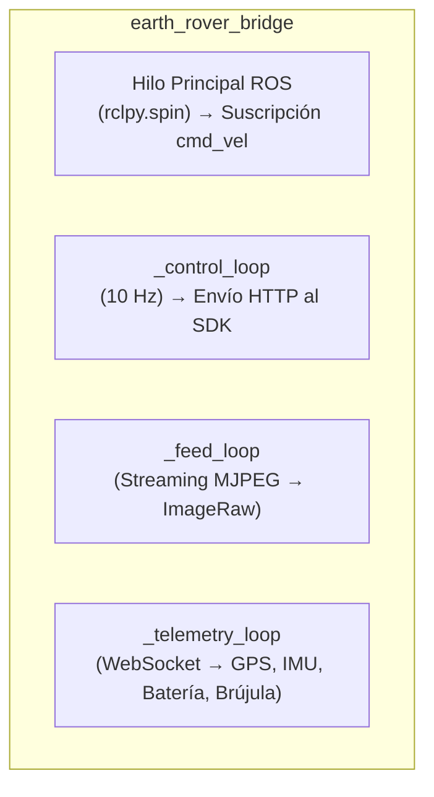
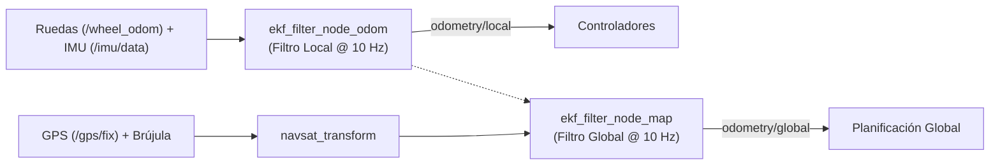
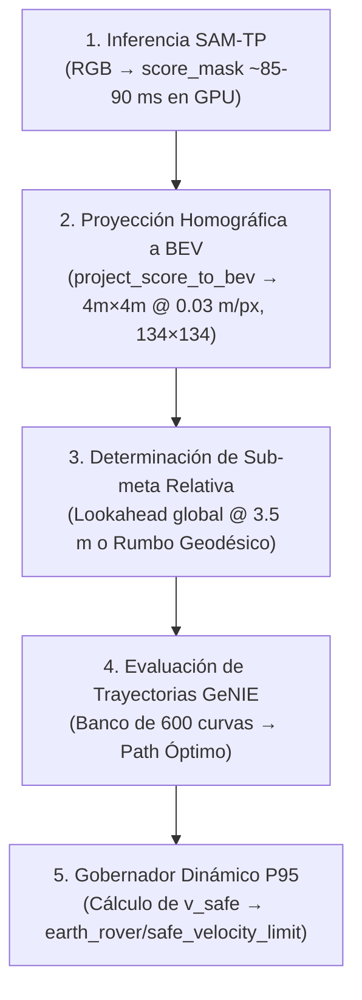
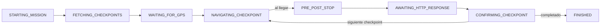

# Arquitectura del Sistema — Nodo por Nodo

Este documento describe en profundidad la arquitectura del software de navegación autónoma del rover: responsabilidades funcionales, mecanismos de concurrencia, transformaciones geométricas y fundamentos de diseño de cada nodo. Complementa al [README.md](file:///root/ros2_ws/README.md) enfocándose en el funcionamiento interno del stack.

El flujo de información sigue una estructura jerárquica: desde la ingesta de sensores y telemetría de bajo nivel, pasando por la estimación de estado, la percepción reactiva BEV, la acumulación semántica-espacial y la planificación D* Lite, hasta la generación y ejecución de comandos motrices.

---

## Estructura de Paquetes del Workspace

El sistema se distribuye en los siguientes paquetes de ROS 2:

| Paquete | Rol Principal | Componentes / Nodos Clave |
| :--- | :--- | :--- |
| **`earth_rovers_sdk`** | Puente entre el SDK HTTP/WebSocket y ROS 2 | `earth_rover_bridge` |
| **`mini_plus_localization`** | Localización y fusión sensorial dual (EKF local y global) | `ekf_filter_node_odom`, `ekf_filter_node_map`, `navsat_transform` |
| **`er_perception`** | Percepción reactiva ligera y utilidades de transitabilidad | `traversability_node`, generadores de overlays visuales |
| **`er_planning`** | Planificación reactiva local, mapa persistente y ruta global | `bev_planner_node`, `persistent_map_node`, `global_planner_node` |
| **`er_navigation`** | Control cinemático de seguimiento de trayectoria | `gps_waypoint_controller` |
| **`er_mission`** | Gestión de máquina de estados de misión y checkpoints | `mission_manager_node` |
| **`er_bringup`** | Orquestación de lanzamiento y gestión de fases | `mission1.launch.py`, `mission_manager.launch.py` |

---

## Índice de Nodos y Subsistemas

1. [x] [**`earth_rover_bridge`**](#1-earth_rover_bridge) *(paquete `earth_rovers_sdk`)*
2. [x] [**`mini_plus_localization`**](#2-mini_plus_localization) *(paquete `mini_plus_localization` — EKF dual, `navsat_transform`)*
3. [x] [**`bev_planner_node`**](#3-bev_planner_node) *(paquete `er_planning` / integración con `er_perception`)*
4. [x] [**`persistent_map_node`**](#4-persistent_map_node) *(paquete `er_planning`)*
5. [x] [**`global_planner_node`**](#5-global_planner_node) *(paquete `er_planning`)*
6. [x] [**`gps_waypoint_controller`**](#6-gps_waypoint_controller) *(paquete `er_navigation`)*
7. [x] [**`mission_manager_node`**](#7-mission_manager_node) *(paquete `er_mission`)*
8. [x] [**`Filtro Complementario Roll/Pitch`**](#8-filtro-complementario-de-inclinación-roll--pitch) *(paquete `earth_rovers_sdk`)*
9. [x] [**`Gobernador Dinámico de Velocidad`**](#9-gobernador-dinámico-de-velocidad) *(paquete `er_planning`)*
10. [x] [**`Limitaciones Conocidas y Trabajo Pendiente`**](#10-limitaciones-conocidas-y-trabajo-pendiente) *(análisis integral)*

---

## 1. `earth_rover_bridge`

> **Paquete:** `earth_rovers_sdk`  
> **Rol:** Interfaz de comunicación entre el servidor SDK de hardware y ROS 2

### Rol y arquitectura general

Este nodo actúa como capa de abstracción de hardware y traducción de protocolos. No ejecuta lógica de navegación ni de decisión:
1. Ingesta el flujo de datos del servidor SDK (servicio Hypercorn en puerto `:8000`) y lo transforma a tipos de mensajes estándar de ROS 2 (`sensor_msgs`, `nav_msgs`).
2. Recibe los comandos de velocidad (`cmd_vel`) generados por la capa de control (`gps_waypoint_controller`) y los transmite al SDK vía peticiones HTTP.

El nodo opera mediante **cuatro hilos concurrentes**, desacoplados por requerimientos de latencia y volumen de datos:

- **Hilo principal de ROS (`rclpy.spin`):** Atiende exclusivamente las suscripciones de entrada (`cmd_vel`).
- **`_control_loop`:** Despacha comandos de velocidad al SDK a una frecuencia periódica estricta de 10 Hz.
- **`_feed_loop`:** Captura y publica el stream de video de la cámara frontal.
- **`_telemetry_loop`:** Procesa el flujo WebSocket continuo con lecturas de GPS, IMU, nivel de batería y brújula.

> [!NOTE]
> **Aislamiento de hilos por criticidad temporal:**  
> La separación multihilo evita que operaciones de alta carga de E/S (como la decodificación de video MJPEG o el procesamiento de tramas WebSocket) bloqueen la emisión determinística del bucle de control de 100 ms.

---

### Políticas de Calidad de Servicio (QoS)

Se configuran dos perfiles de QoS diferenciados según la naturaleza del flujo de datos:

| Perfil QoS | Política de Fiabilidad | Tópicos Asociados | Justificación de Diseño |
| :--- | :--- | :--- | :--- |
| `image_qos` | `BEST_EFFORT` | Cámara, Batería, Heading | Flujos continuos de alta frecuencia donde prima la baja latencia sobre la recuperación de paquetes perdidos. |
| `filter_qos` | `RELIABLE` | IMU, Odometría, GPS | Flujos de estimación de estado consumidos por filtros EKF. |

> [!WARNING]
> **Compatibilidad de QoS con `robot_localization`:**  
> Los suscriptores de la librería `robot_localization` operan por defecto con política `RELIABLE`. Si un publicador emite bajo `BEST_EFFORT`, la capa intermedia DDS descarta las muestras sin emitir alertas ni errores en tiempo de ejecución, provocando que los filtros de estimación queden inactivos silenciosamente.

---

### Modelado de Covarianzas Sensoriales

El nodo parametriza matrices de covarianza para calibrar la ponderación de cada sensor en el filtro de Kalman:

- **Odometría de ruedas:** Aplica una penalización estricta a la velocidad lateral ($v_y$, varianza $2.0$) debido a las restricciones no holonómicas del chasis con ruedas (el deslizamiento lateral representa perturbación no informativa).
- **IMU:** Varianza inflada controlada ($0.05$ - $0.1$) para absorber vibraciones mecánicas inducidas por los cuatro motores DC y fluctuaciones de temporización del canal de telemetría.
- **GPS:** Covarianza de altitud fuertemente penalizada ($100.0$ frente a $1.0$ en plano horizontal) dado el error vertical intrínseco del posicionamiento geodésico y el carácter bidimensional de la navegación del rover.

Todas las matrices están expuestas mediante `declare_parameter`, permitiendo calibraciones dinámicas vía archivos `.yaml` sin recompilación de código.

---

### Bucle de Control y Mecanismo Dead Man's Switch (`_control_loop`)

`_on_cmd_vel` almacena el comando de velocidad más reciente con su correspondiente marca de tiempo bajo protección de bloqueo de exclusión mutua (`threading.Lock`).

`_control_tick` ejecuta a 10 Hz e implementa la protección de seguridad principal:

> [!IMPORTANT]
> **Mecanismo de Parada por Pérdida de Comunicación (Dead Man's Switch):**  
> Si transcurren más de $0.5\text{ s}$ (`CMD_VEL_TIMEOUT_S`) sin recibir consignas de velocidad válidas, el nodo transmite automáticamente `{linear: 0, angular: 0}`. Esto garantiza que ante caídas o congelamientos de los nodos aguas arriba, el vehículo se detenga de forma autónoma en un intervalo máximo de 500 ms.

Adicionalmente, se publica telemetría de diagnóstico en `bridge_debug` registrando el retardo total del ciclo (tiempo de recepción ROS, despacho HTTP y confirmación del servidor), permitiendo caracterizar la latencia del canal de comunicaciones para el diseño de controladores predictivos (ej. Predictor de Smith / MPC).

---

### Conversión de Convenciones de Orientación (`_compass_heading_to_enu_yaw`)

La brújula electrónica reporta rumbos bajo la convención de navegación clásica ($0^\circ = \text{Norte}$, sentido horario). El estándar espacial de ROS (REP-103) estipula el marco ENU (*East-North-Up*: $0\text{ rad} = \text{Este}$, sentido antihorario).

Para garantizar la consistencia en el EKF, la transformación matemática aplicada es:

$$\text{yaw}_{\text{ENU}} = \left(\frac{\pi}{2} - \text{heading}_{\text{rad}}\right) + \delta_{\text{mag}}$$

donde $\delta_{\text{mag}}$ representa la declinación magnética local configurable por parámetro.

---

### Adquisición de Video (`_feed_loop`)

El stream MJPEG es adquirido mediante OpenCV (`cv2.VideoCapture`).

- **Reducción de Latencia:** Se configura `capture.set(cv2.CAP_PROP_BUFFERSIZE, 1)`. Esta restricción impide la acumulación de tramas antiguas en buffer, asegurando que los nodos de percepción procesen siempre el fotograma más reciente disponible.
- **Resiliencia de Conexión:** Implementa reconexión periódica cada 3 segundos ante cortes en el transporte de red.

---

### Telemetría y Preprocesamiento Sensorial (`_telemetry_loop`)

El procesamiento de tramas WebSocket entrantes comprende cuatro etapas:

1. **Validación y Escalado Dinámico de GPS:**  
   Prioriza el indicador de estado de fijación (`fix_quality`). Ante ausencia del campo, valida un umbral mínimo de 4 satélites visibles. Si la solución es inválida o el indicador de dispersión geométrica (HDOP) supera 20, descarta la lectura y activa modo de navegación a estima (*Dead-Reckoning*).  
   La matriz de covarianza asociada se modula dinámicamente en función de $\text{HDOP}^2$, atenuando la influencia del sensor cuando la constelación geométrica es desfavorable.

2. **Publicación de Orientación:**  
   Publica el rumbo directo para consumo de control y el yaw convertido a formato ENU para la fusión en el EKF.

3. **Monitoreo de Batería:**  
   Publicación directa del estado de carga energética.

4. **Preprocesamiento Sensorial de IMU y Odometría:**  
   El hardware transmite ráfagas de aceleración y velocidad angular en paquetes WebSocket cada ~2 segundos.  
   * **Problema del diseño anterior:** Se interpolaban artificialmente marcas de tiempo retroactivas ($dt = 2.0 / N \approx 50\text{ Hz}$) emitiendo 100 mensajes IMU en el pasado. Esto provocaba dos fallas graves: (1) violación de la causalidad temporal en los buffers TF y descarte sistemático de paquetes en `robot_localization`, y (2) una sobreconfianza artificial de $100\times$ en el rumbo magnético que asfixiaba la estimación del EKF.  
   * **Comportamiento actual:** Se publica **un único mensaje `sensor_msgs/Imu` en `/imu/data` por reporte de telemetría** con el timestamp actual de ROS, la aceleración lineal promediada de la ráfaga (descontando `accel_bias`) y la velocidad angular promediada corregida por el sesgo calibrado (`_gyro_bias`).  
   * **Odometría de tracción:** Se calcula mediante integración cinemática bidimensional ($v \cdot \Delta t \cdot [\cos(\theta), \sin(\theta)]$) y se publica en el tópico `/wheel_odom` (`nav_msgs/Odometry`). La pose filtrada en `odometry/local` es responsabilidad exclusiva de `ekf_filter_node_odom`.  
   * **Carga de Calibración Inercial:** Mediante `_load_inertial_calibration_files()`, el bridge busca automáticamente `config/gyro_bias.json` y `config/accel_bias.json` al inicializar; si no existen, inicializa limpiamente en $0.0$.

---

### Secuencia de Apagado Controlado (`destroy_node`)

Durante la destrucción del nodo (señales `SIGINT` / `SIGTERM`), el método `destroy_node` despacha hasta 3 consignas consecutivas de parada `{linear: 0, angular: 0}` antes de clausurar la sesión HTTP, asegurando la inmovilización inmediata del vehículo.

---

## 2. `mini_plus_localization`

> **Paquete:** `mini_plus_localization`  
> **Rol:** Estimación de estado y fusión multisensorial mediante arquitectura Dual-EKF

### Arquitectura Dual-EKF

Para conciliar la necesidad de una estimación continua y suave con el anclaje georreferenciado global, se implementa una topología de dos filtros de Kalman extendidos en cascada (`robot_localization`):

- **Filtro Local (`ekf_filter_node_odom`):** Fusiona la odometría de ruedas `/wheel_odom` y la aceleración/velocidad angular de `/imu/data` a una frecuencia fija de **`frequency: 10.0` Hz**. Publica `odometry/local` y la transformada `odom` $\to$ `base_link`. Su salida es continua y monótona, libre de saltos de satélite, ideal para los lazos de control cinemático.
- **Filtro Global (`ekf_filter_node_map`):** Fusiona la odometría local junto a las lecturas geodésicas procesadas por `navsat_transform` a **`frequency: 10.0` Hz**. Publica `odometry/global` y la transformada `map` $\to$ `odom`.

---

### Estructura del Árbol de Transformadas (TF)

La cadena cinemática global se define según las especificaciones de ROS:

$$\text{map} \xrightarrow[\text{ekf\_filter\_node\_map}]{} \text{odom} \xrightarrow[\text{ekf\_filter\_node\_odom}]{} \text{base\_link}$$

Ambos nodos operan con `publish_tf: true` complementándose mutuamente sin generar redundancias en el grafo de transformadas.

---

### Parámetros Críticos y Limitación Arquitectónica de Orientación

- **`odom0_config` (Filtro Local):** Se restringe únicamente a velocidades lineales ($V_x, V_y$), manteniendo $V_{\text{yaw}}$ (índice 11) en `false`. Al carecer de encoders independientes por rueda, la velocidad angular de guiñada se delega a la IMU.
- **Limitación de Fuente Única de Guiñada:** Actualmente **no existe una fuente de orientación absoluta independiente de la brújula magnética**. Dado que `/wheel_odom` se proyecta trigonométricamente usando el mismo rumbo de compás que alimenta `/imu/data`, ambas señales se desvían de forma correlacionada ante distorsiones magnéticas del entorno, impidiendo que el EKF detecte la inconsistencia.
- **`imu0_relative`:** Configurado en `true` para el filtro local (origen relativo en $\text{yaw}=0$) y en `false` para el filtro global (orientación absoluta respecto al polo magnético/geográfico).
- **Compensación de Retardo de Red:** Parámetros `sensor_timeout: 2.0`, `delay: 0.1` y `transform_time_offset: 0.05`. Este último publica las transformadas con un adelanto de 50 ms para prevenir errores de extrapolación temporal en nodos clientes ante fluctuaciones de red.

---

### Proyección Geodésica (`navsat_transform`)

El nodo `navsat_transform` convierte coordenadas geográficas (latitud, longitud, altitud) en posiciones cartesianas métricas dentro del marco `map`, y publica `gps/filtered` convirtiendo continuamente la pose global del EKF a WGS84 por *dead-reckoning* durante cortes de señal GNSS.

La inicialización del origen geodésico (*datum*) se realiza cargando `datum_resolved.yaml` (calculado dinámicamente en la inicialización a partir del primer checkpoint), evitando la selección arbitraria del primer fix GPS ruidoso.

---

## 3. `bev_planner_node`

> **Paquete:** `er_planning` *(Integración de modelos de `er_perception`)*  
> **Rol:** Percepción de transitabilidad en perspectiva cenital (BEV) y planificación reactiva local

### Rol y Mecánica de Ejecución

Constituye el subsistema reactivo de evasión de obstáculos en el entorno inmediato ($4\text{ m}$). Opera de forma autónoma calculando trayectorias seguras hacia sub-metas intermedias o directas a destino.

El procesamiento se desacopla en un hilo independiente (`_planning_loop`):
1. Consume el fotograma más reciente almacenado en `self._latest_rgb`.
2. Impone un período mínimo de cómputo (`planning_min_period_s = 0.1` $\to$ máx. 10 Hz).
3. Si la tasa de generación de imágenes excede la capacidad de inferencia, se descartan fotogramas intermedios para garantizar nula acumulación de latencia en la toma de decisiones.

---

### Pipeline de Planificación por Cuadro (`_run_planning`)

1. **Inferencia de Transitabilidad (SAM-TP):** Segmenta la superficie transitable generando una matriz de puntuación continua (`score_mask`). Tiempo de ejecución típico: ~85–90 ms en acelerador GPU RTX 5060 (~4.5 s en CPU).
2. **Proyección en Perspectiva Cenital (`project_score_to_bev`):** Mediante parámetros intrínsecos (`camera_k`) y extrínsecos (`camera_t`) con hipótesis de plano de suelo (`ground_z = 0.0`), proyecta la máscara a una grilla métrica cenital isótropa de $4.0\text{m} \times 4.0\text{m}$ ($134 \times 134$ celdas a $0.03\text{ m/px}$, $\lceil 4.0/0.03 \rceil = 134$). Publica la grilla en `earth_rover/local_bev_grid`.
3. **Selección de Meta Relativa:**
   - *Modo Jerárquico:* Si existe una ruta global válida y vigente (`_global_path_is_fresh()`, antigüedad $< 3.0\text{ s}$), extrae una sub-meta a una distancia de prospección (`global_lookahead_distance_m = 3.5\text{ m}`).
   - *Modo Fallback:* Si la ruta global expira o es inválida, computa el rumbo directo por trigonometría esférica (fórmula de Haversine).
4. **Optimización de Trayectoria GeNIE (`_plan_on_bev`):** 
   - El banco contiene **600 trayectorias polinomiales precomputadas una única vez al inicio en `__init__`**.
   - Evalúa las 600 curvas contra la grilla de costos locales con huella dilada (`footprint_px = ceil(0.30 / 0.03) = 10\text{ px}`). En un escenario despejado, sobreviven al filtro de colisión típicamente $\approx 277$ curvas.
   - Aplica agrupamiento direccional K-Means (`max_clusters = 4`) y fusión de los mejores candidatos (`best_k = 12`).
   - *Hallazgo de escalamiento:* La latencia de GeNIE escala con la cantidad de caminos sobrevivientes; por lo tanto, el planner evalúa más rápido en entornos con obstáculos que en áreas completamente despejadas.
5. **Gobernador Dinámico de Velocidad P95:** Registra la latencia total del ciclo en una ventana móvil de 30 muestras, calcula el percentil 95 ($t_{\text{plan,P95}}$) y resuelve la velocidad máxima segura $v_{\text{safe}}$ garantizando parada dentro del horizonte visible ($2.40\text{ m}$) con margen de seguridad $1.5$. Si $v_{\text{safe}} < 0.15\text{ m/s}$, aplica corte a $0.0$ (*Stop & Wait*). Publica el límite en `earth_rover/safe_velocity_limit`.

---

### Transformaciones Geométricas Locales vs Globales

- **`genie_xy_to_ros_base_link()`:** Convierte la salida cinemática local de GeNIE al estándar ROS ($x_{\text{adelante}} = y_{\text{genie}}, y_{\text{izquierda}} = -x_{\text{genie}}$) mediante rotación rígida constante a tiempo idéntico.
- **`_compute_global_subgoal_base_link()`:** Transforma puntos expresados en el marco inercial `map` al marco móvil `base_link` utilizando la pose completa y orientación $\text{yaw}$ provistas por TF en el instante actual.
- **Validación de Isotropía:** Garantiza que la resolución métrica por píxel en el eje longitudinal ($X$) y lateral ($Y$) sea estrictamente idéntica ($0.03\text{ m/px}$), preservando la geometría euclidiana y radios de curvatura de las trayectorias muestreadas.

---

## 4. `persistent_map_node`

> **Paquete:** `er_planning`  
> **Rol:** Memoria espacial acumulativa y fusión de evidencia sensorial con información semántica

### Estructura de Doble Canal

El mapa global integra dos capas de información complementarias:
- **Capa Dinámica (`self._confidence`):** Registra observaciones sensoriales locales de la cámara. Aplica decaimiento exponencial periódico (`decay_factor = 0.7738` cada 5 s, vida media efectiva $\approx 12\text{ s}$) para olvidar obstáculos temporales.
- **Capa Semántica Estática (`self._semantic`):** Representa información previa de infraestructura (veredas, calzadas) extraída de OpenStreetMap (`seed_map_path`). No decae con el tiempo.

---

### Ingesta y Agregación de Evidencia (`_on_local_grid`)

1. **Transformación Rígida de Grilla:** Proyecta las celdas locales al marco `map` aplicando la traslación y ángulo $\theta$ derivados del árbol TF:
   $$x_{\text{map}} = t_x + x_{\text{local}}\cos(\theta) - y_{\text{local}}\sin(\theta)$$
   $$y_{\text{map}} = t_y + x_{\text{local}}\sin(\theta) + y_{\text{local}}\cos(\theta)$$
2. **Discretización:** Convierte coordenadas métricas continuas a índices discretos en la grilla global de $400\text{m} \times 400\text{m}$ con resolución de $0.20\text{ m/px}$.
3. **Votación Agrupada por Celda:** Dado que $\approx 44$ celdas de la grilla local ($0.03\text{ m/px}$) coinciden espacialmente sobre una única celda de la grilla persistente ($0.20\text{ m/px}$), el nodo agrupa las observaciones locales (`np.unique`) y emite un único voto por celda global por cuadro (voto positivo si la fracción de celdas locales con obstáculo supera `hit_vote_threshold = 0.15`).

---

### Regla de Fusión Semántica y Evidencia Dinámica

La combinación de canales implementa una regla de precedencia condicional:

$$\text{grid\_effective} = \begin{cases} 
\max(C, S) & \text{si } C \ge \text{semantic\_override\_threshold} \\
S & \text{si } |S| \ge \text{unknown\_evidence\_band} \\
C & \text{en otro caso}
\end{cases}$$

Con `semantic_override_threshold = 30.0`, se asegura que la evidencia sensorial de la cámara deba registrar un mínimo de 2 detecciones consecutivas para imponer un obstáculo sobre un área categorizada a priori como transitable (vereda).

---

## 5. `global_planner_node`

> **Paquete:** `er_planning`  
> **Rol:** Planificación global de rutas de largo alcance mediante D* Lite

### Fundamento Algorítmico (D* Lite)

A diferencia de algoritmos estáticos como A* (que recalculan el árbol de búsqueda completo desde el nodo origen ante cualquier modificación del entorno), **D\* Lite** mantiene la estructura de costos a la meta y propaga incrementalmente los cambios únicamente sobre las celdas afectadas y sus vecinos inmediatos.

---

### Conversión de Grilla de Ocupación a Costos de Tránsito (`_on_map`)

Los valores de `nav_msgs/OccupancyGrid` se asignan a pesos de tránsito para el grafo de búsqueda:

| Valor en Grilla | Clasificación | Costo Asignado ($c$) | Comportamiento en Planificación |
| :---: | :---: | :---: | :--- |
| `-1` | Desconocido | $2.5$ | Costo moderado que permite exploración cautelosa. |
| $[0, 40]$ | Libre confirmado | $1.0$ | Costo mínimo unitario (preferencia máxima). |
| $(40, 78)$ | Zona de transición | Interp. lineal $[1.0, 15.0]$ | Costo progresivamente penalizado. |
| $\ge 78$ | Ocupado confirmado | $\infty$ | Arista intransitable (bloqueo total). |

#### Inflación de Huella (*Footprint Inflation*)
Las celdas con costo infinito son dilatadas morfológicamente según el radio físico del chasis:
$$\text{inflation\_cells} = \left\lceil \frac{\text{footprint\_inflation\_radius\_m}}{\text{map\_resolution\_m\_per\_px}} \right\rceil = \left\lceil \frac{0.15}{0.20} \right\rceil = 1\text{ celda}$$
La máscara de dilatación en base a la norma $(x^2 + y^2) \le 1$ genera una conectividad en cruz de 4 vecinos, aproximando un perímetro circular sin sobreestimación diagonal.

---

### Consistencia de Vértices ($g$ vs $rhs$)

D* Lite modela la consistencia de cada nodo $u$ mediante dos variables:
- $g(u)$: Costo computado actual para alcanzar la meta desde $u$.
- $rhs(u)$: Estimación en un paso basada en los costos de los vecinos inmediatos:
  $$rhs(u) = \min_{s' \in \text{Succ}(u)} \left( c(u, s') + g(s') \right)$$

$$\begin{cases}
g(u) = rhs(u) & \implies \text{Vértice Consistente} \\
g(u) \neq rhs(u) & \implies \text{Vértice Inconsistente (se inserta en la cola de prioridad)}
\end{cases}$$

El bucle `_compute_shortest_path` procesa vértices inconsistentes en orden de prioridad hasta restablecer la consistencia en el nodo donde se ubica el rover (`s_start`).

---

### Compensación de Desplazamiento ($k_m$) y Borrado Perezoso

- **Término de Compensación $k_m$:** Al desplazarse el vehículo, la distancia heurística cambia para todos los nodos. D* Lite evita actualizar las claves de toda la cola acumulando el desplazamiento en $k_m \leftarrow k_m + h(s_{\text{last}}, s_{\text{current}})$, modificando únicamente las claves de los elementos reevaluados.
- **Borrado Perezoso (*Lazy Removal*):** Para evitar reordenamientos costosos en el montículo binario (`heapq`), las claves invalidadas se eliminan de un diccionario auxiliar `_pq_dict`. Al extraer elementos de la cola, se descartan aquellos cuya versión no coincida con el registro activo.

---

### Temporización y Modulación de Replanificación

- **Sondeo y Ventana Mínima:** Posee un temporizador base de sondeo a 2 Hz (`heartbeat_period_s = 0.5`), pero exige un intervalo mínimo entre replanificaciones completas (`replan_min_period_s = 2.0\text{ s}`).
- **Disparo Asíncrono Reactivo:** Si se recibe una actualización crítica del mapa persistente tras expirar el período de 2 s, `_on_map` lanza la replanificación inmediatamente sin esperar al siguiente ciclo del temporizador.
- **Validación de Localización:** Si la celda correspondiente a la pose del rover posee costo infinito, el planificador rechaza la búsqueda (`is_valid = False`), protegiendo el sistema contra errores de divergencia en la estimación de estado.

---

## 6. `gps_waypoint_controller`

> **Paquete:** `er_navigation`  
> **Rol:** Seguimiento cinemático de waypoints y control de velocidad (el que efectivamente mueve las ruedas)

### Rol

Es la capa más baja de la jerarquía de decisión: no decide "hacia dónde ir" en un sentido estratégico (eso lo hacen `bev_planner_node`/`global_planner_node`), decide cómo traducir "hacia allá" en comandos concretos de motor, respetando las limitaciones físicas y de red del rover real (latencia 4G, brújula ruidosa, GPS que llega a 1Hz).

---

### Los valores reales que rigen hoy (del YAML, sin clamps)

Con el hallazgo confirmado —el código ya no clampea nada—, estos son los números que gobiernan el rover en producción:
- `goal_tolerance_m`: `13.0`
- `align_threshold_deg`: `18.0` (umbral fino, cerca de la meta)
- `coarse_align_threshold_deg`: `25.0` (umbral grueso, lejos)
- `approach_align_distance_m`: `8.0` (el punto donde pasa de uno a otro)
- `forward_speed`: `0.40`
- `turn_speed`: `0.70`
- `control_loop_hz`: `3.0`
- `turn_burst_s`: `0.25`
- `pause_after_turn_s`: `0.80`
- `max_heading_jump_deg`: `150.0`
- `heading_filter_alpha`: `0.35`
- `gps_max_stale_s`: `2.0`
- `heading_max_stale_s`: `2.0`
- `path_max_stale_s`: `8.0`
- `require_velocity_governor`: `true`
- `geodesic_fallback_speed`: `0.20`

---

### El orden de las guardas de seguridad en `_control_loop`

Cada ciclo (3 Hz) evalúa en este orden estricto, saliendo apenas una condición aplica:

1. **Pausa externa (`_navigation_paused`):** Si `mission_manager_node` pausó la navegación, frena inmediatamente ($v=0, \omega=0$) y no evalúa nada más.
2. **Esperando confirmación del SDK (`_awaiting_next_target`):** Ya llegó a la meta; republica periódicamente `REACHED` sin avanzar mientras espera que el manager confirme el checkpoint.
3. **Datos insuficientes:** Sin meta activa (`target_lat is None`) o sin GPS (`current_lat is None`), no emite movimiento.
4. **GPS viejo (`_gps_is_fresh()` con `gps_max_stale_s = 2.0`):** Frena y espera sin navegar a ciegas.
5. **Heading viejo (`_heading_is_fresh()` con `heading_max_stale_s = 2.0`):** Si los datos de brújula se congelan por más de 2 segundos (o son rechazados sucesivamente por la guarda de salto de $150^\circ$), frena de inmediato por seguridad. Un rumbo desactualizado es mucho más peligroso que la ausencia de dato, pues comandaría rotaciones y avances hacia direcciones arbitrarias.

---

### La selección de fuente de rumbo y velocidad (Arquitectura Fail-Safe)

El diseño anterior operaba en modo *Fail-Open* (si el planificador fallaba, el rover avanzaba a máxima velocidad hacia el GPS). El diseño actual es **estrictamente Fail-Safe**:

1. **Seguimiento de Trayectoria BEV:** Si hay un camino válido y fresco (`path_max_stale_s = 8.0`), sigue los waypoints con lookahead dinámico (`lookahead_distance_m = 1.0`).
2. **Recovery Mode Activo:** Si el camino está fresco pero no es válido (`planner_valid = False`), entra en `RECOVERY` rotando en el lugar (`recovery_turn_speed = 0.3\text{ rad/s}`) para despejar el campo visual sin avanzar hacia el obstáculo.
3. **Gobernador de Velocidad Dinámico:**
   - **Caso 1 (Nunca recibido):** Si `require_velocity_governor: true`, $v_{\text{eff}} = 0.0\text{ m/s}$ (detención por arranque o caída temprana del planner). Si `require_velocity_governor: false` (modo geodésico puro deliberado), $v_{\text{eff}} = \min(v_{\text{fallback}}, v_{\text{fwd}}) = 0.20\text{ m/s}$.
   - **Caso 2 (Vigente $\le 3.0\text{ s}$):** $v_{\text{eff}} = \min(v_{\text{fwd}}, v_{\text{safe}})$.
   - **Caso 3 (Expirado $> 3.0\text{ s}$):** Si `path_following_enabled: true`, detención total $v_{\text{eff}} = 0.0\text{ m/s}$. En navegación geodésica pura, limita a $v_{\text{eff}} = 0.20\text{ m/s}$.

---

### Burst & Wait Adaptativo y Detector de Rechazo del SDK

* **Ráfaga Dinámica según Error de Rumbo:**
  - $\text{error} > 30^\circ \implies$ ráfaga de $0.65\text{ s}$ (giro agresivo).
  - $\text{error} > 15^\circ \implies$ ráfaga de $0.40\text{ s}$ (giro medio).
  - $\text{error} \le 15^\circ \implies$ ráfaga de $0.22\text{ s}$ (micro-ajuste fino).
* **Detector de Rechazo:** Si el manager despausa mientras `_awaiting_next_target` sigue activo (indicando que el backend del SDK rechazó el checkpoint por distancia insuficiente), el controlador reduce automáticamente su tolerancia a la mitad (`goal_tolerance *= 0.5`, piso en $0.5\text{ m}$), convergiendo hacia el centro del checkpoint.

---

## 7. `mission_manager_node`

> **Paquete:** `er_mission`  
> **Rol:** Gestión de objetivos de alto nivel, orquestación del ciclo de vida y comunicación con SDK

### Rol y Máquina de Estados

Es el único nodo que interactúa con la API REST del SDK. 

---

### Concurrencia Protegida con `threading.Lock()` y Protocolo Asíncrono

`_notify_checkpoint_reached` no bloquea el executor de ROS:
1. Pasa al estado `PRE_POST_STOP`, pausa la navegación (`earth_rover/navigation_pause -> True`) e inicia un hilo secundario `http_worker`.
2. El hilo ejecuta la petición HTTP `POST /checkpoint-reached`.
3. Las variables compartidas (`_http_response_data`, `_http_response_status`, `_http_request_in_flight`) se leen y escriben bajo protección atómica estricta con **`self._http_lock = threading.Lock()`**, previniendo condiciones de carrera con el bucle de la máquina de estados a 1 Hz.

---

### Reanudación de Misión y Warm Start (`_abort_and_resume_navigation`)

Ante rechazos del SDK o reintentos de comunicación, `_abort_and_resume_navigation()` despausa el controlador (`navigation_pause -> False`) e invoca determinísticamente a **`_publish_current_checkpoint_goal()`**, republicando las coordenadas del objetivo actual en `earth_rover/target_waypoint` para que el controlador reanude el guiado sin quedar inactivo.

*(Nota: En la auditoría de limpieza se eliminó el método inalcanzable `_post_checkpoint_task` y los imports duplicados).*

---

## 8. Filtro Complementario de Inclinación (Roll / Pitch)

> **Paquete:** `earth_rovers_sdk` (`bridge_node.py`)  
> **Rol:** Estimación continua de inclinación sobre el plano de rodadura y diagnóstico inercial

### Justificación Física y Sustitución del Watchdog

El diseño anterior empleaba un watchdog que reseteaba arbitrariamente $\text{roll} = 0.0$ y $\text{pitch} = 0.0$ tras 6 segundos con aceleración no estacionaria. En rampas rugosas o puentes con vibración continua ($\sigma_m > 0.06\text{ g}$), este reseteo provocaba que el rover afirmara falsamente estar sobre terreno plano mientras ascendía pendientes de $10^\circ$, introduciendo discontinuidades y un error de rumbo proyectado de hasta $16.7^\circ$.

### Doble Compuerta Estadística y Propagación Continua

El filtro complementario implementa una compuerta dual basada en la magnitud media y dispersión del vector de aceleración corregido por sesgo $\mathbf{a} = (a_x, a_y, a_z)$:
1. **Compuerta Abierta (Aceleración Estacionaria):**
   $$|\|\mathbf{a}\| - 1.0\text{ g}| < 0.08\text{ g} \quad \land \quad \sigma_m < 0.06\text{ g}$$
   Se actualizan roll y pitch fusionando la inclinación del acelerómetro con la integración giroscópica ($\alpha = 0.20$):
   $$\theta_k = (1 - \alpha)(\theta_{k-1} + \omega_y \cdot \Delta t) + \alpha \cdot \theta_{\text{acc}}$$
   $$P_{\theta, k} = (1 - \alpha)^2 (P_{\theta, k-1} + Q \cdot \Delta t) + \alpha^2 \cdot \sigma_{\text{acc}}^2$$
2. **Compuerta Cerrada (Movimiento Acelerado / Vibración Sostenida):**
   El acelerómetro se desacopla por completo y el ángulo se propaga puramente por integración de giróscopo:
   $$\theta_k = \theta_{k-1} + \omega_y \cdot \Delta t$$
   $$P_{\theta, k} = P_{\theta, k-1} + Q \cdot \Delta t \quad (Q = 0.005\text{ rad}^2/\text{s})$$
3. **Telemetría de Diagnóstico:** Se publica en `earth_rover/tilt_gate_diag` un payload JSON con `gate_open`, `duty_cycle_pct`, `roll_deg`, `pitch_deg`, `roll_std_deg` y `pitch_std_deg`.

---

## 9. Gobernador Dinámico de Velocidad

> **Paquete:** `er_planning` (`bev_planner_node.py`)  
> **Rol:** Cálculo de velocidad máxima admisible en función de la latencia real del pipeline

### Derivación Matemática de la Ecuación de Frenado Cuadrática

La distancia requerida de parada ($d_{\text{stop}}$) con desaceleración constante $a_{\text{brake}} = 1.5\text{ m/s}^2$ y tiempo total de retardo $b = t_{\text{plan,P95}} + t_{\text{rtt}} + t_{\text{delay}}$ es:
$$d_{\text{stop}} = v \cdot b + \frac{v^2}{2 \cdot a_{\text{brake}}}$$

Exigiendo un margen de seguridad multiplicativo $\text{margin} = 1.5$ sobre el horizonte visible $d_{\text{horizon}} = 2.40\text{ m}$:
$$v \cdot b + \frac{v^2}{2 \cdot a_{\text{brake}}} \le \frac{d_{\text{horizon}}}{\text{margin}} \iff \frac{1}{2 \cdot a_{\text{brake}}} v^2 + b \cdot v - \frac{d_{\text{horizon}}}{\text{margin}} = 0$$

Resolviendo para la raíz positiva:
$$v_{\text{safe}} = a_{\text{brake}} \cdot \left( \sqrt{b^2 + \frac{2 \cdot d_{\text{horizon}}}{a_{\text{brake}} \cdot \text{margin}}} - b \right)$$

### Tabla de Comportamiento Nominal ($d = 2.40\text{ m}, \text{margin} = 1.5, a = 1.5\text{ m/s}^2, t_{\text{rtt}} = 0.10\text{ s}, t_{\text{delay}} = 0.041\text{ s}$)

| $t_{\text{plan}}$ (ms) | $b$ (s) | $v_{\text{safe}}$ Teórico (m/s) | $v_{\text{safe}}$ Efectivo (m/s) | Estado Operativo |
| :---: | :---: | :---: | :---: | :--- |
| **280 ms** | 0.421 s | 1.65 m/s | **0.40 m/s** (tope nominal) | Operación fluida en GPU |
| **1000 ms** | 1.141 s | 1.07 m/s | **0.40 m/s** | Umbral de tráfico dinámico |
| **2000 ms** | 2.141 s | 0.68 m/s | **0.40 m/s** | Latencia degradada |
| **8130 ms** | 8.271 s | 0.19 m/s | **0.19 m/s** | Modo arrastre de seguridad |
| **11200 ms** | 11.341 s | 0.14 m/s | **0.00 m/s** (piso $<0.15$) | Parada de seguridad (*Stop & Wait*) |

> [!NOTE]
> **Alerta de Tráfico Dinámico:** Si $t_{\text{plan,P95}} > 1.0\text{ s}$, el nodo emite una advertencia de diagnóstico pues a tasas inferiores a 1 Hz no es posible garantizar la evasión de peatones o vehículos en movimiento rápido.

---

## 10. Limitaciones Conocidas y Trabajo Pendiente

1. **Calibración Óptica Pendiente:** Los parámetros intrínsecos de cámara ($f_x, f_y, c_x, c_y$) y extrínsecos ($h=0.18\text{ m}, \text{pitch}=-8^\circ$) son nominales. La proyección BEV tiene error no cuantificado hasta que se ejecute la calibración física con tablero ChArUco en el rover real.
2. **Dependencia de Sensor de Guiñada Único:** `/wheel_odom` utiliza el mismo rumbo de brújula que alimenta `/imu/data`; por ende, no existe una fuente de orientación independiente para desacoplar perturbaciones magnéticas en el EKF.
3. **Compensación Dinámica de Inclinación:** La rotación homográfica por roll/pitch no está activada en producción para evitar introducir ruido óptico adicional hasta calibrar la cámara.
4. **Telemetría de RPMs sin Explotar:** El SDK reporta `rpms` de tracción pero actualmente no se integran para estimación de patinamiento lateral.
5. **Configuración de Grilla BEV:** El ajuste de resolución de celda ($0.05\text{ m/px}$) permanece congelado a la espera de las mediciones de latencia en la máquina de la RTX 5060.
6. **Optimización de GeNIE:** El frente de poda y reescritura de `third_party/genie` se encuentra suspendido a la espera del profiling formal en hardware final.

